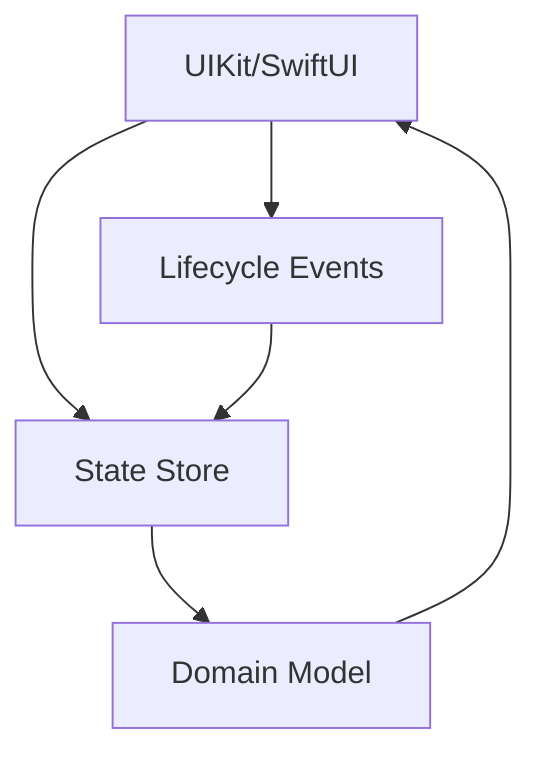
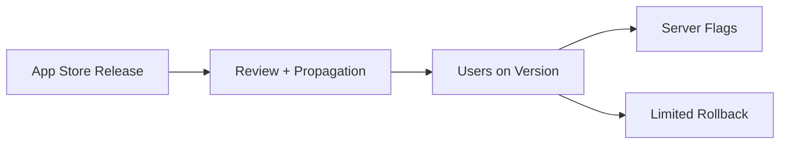
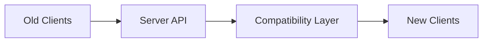
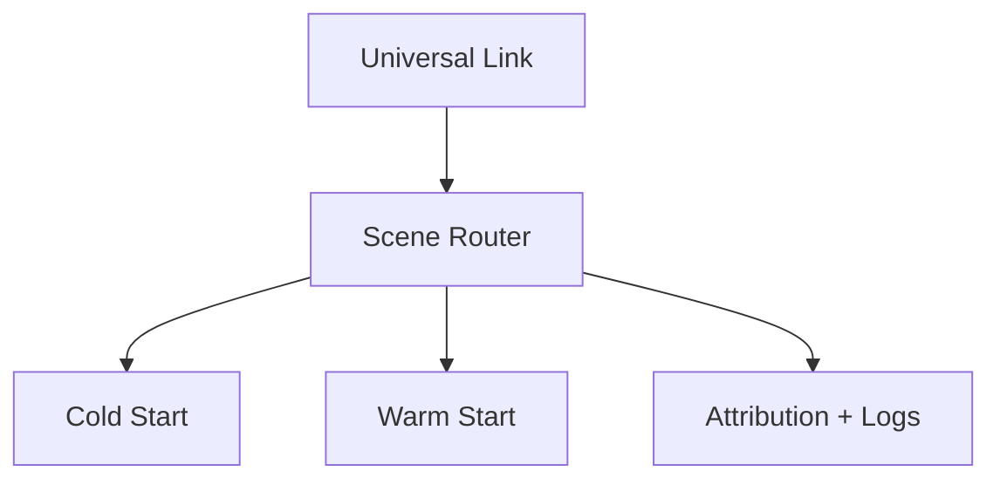
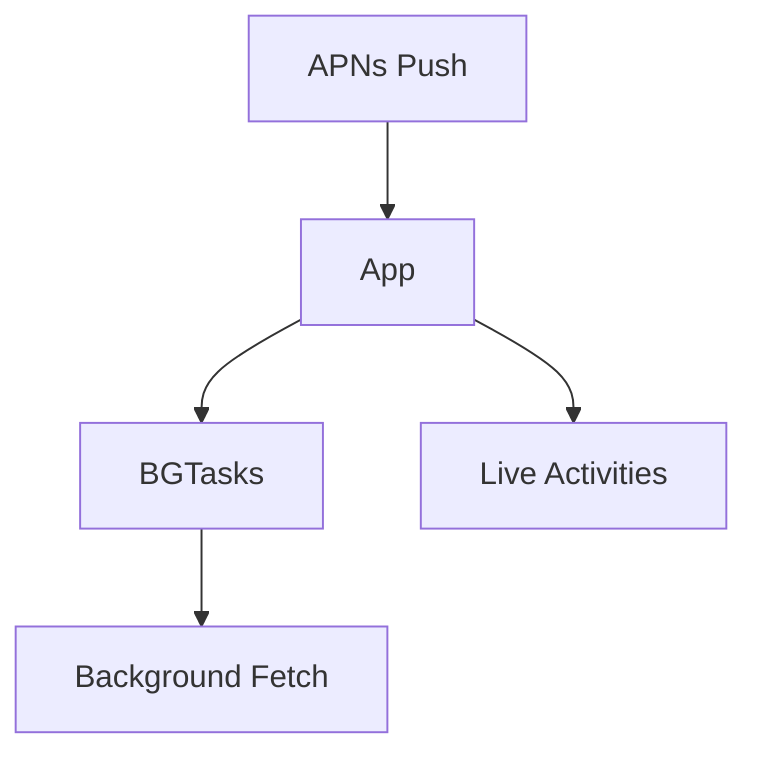
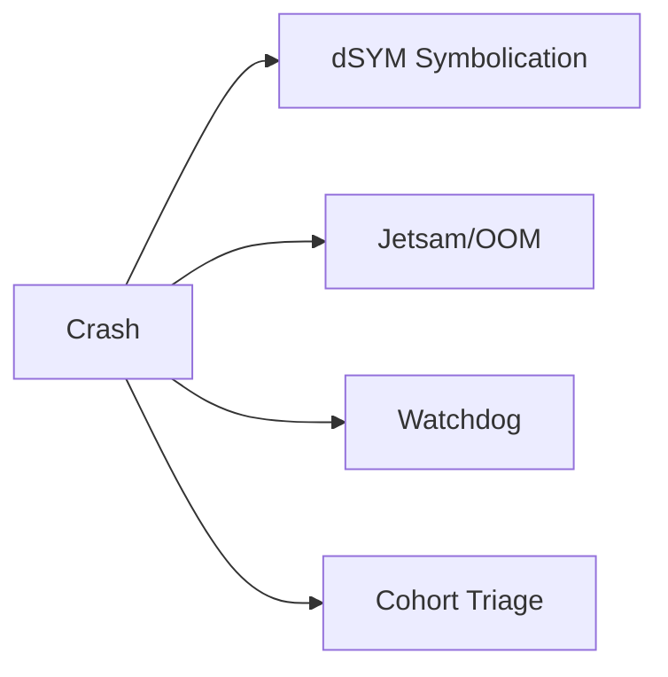
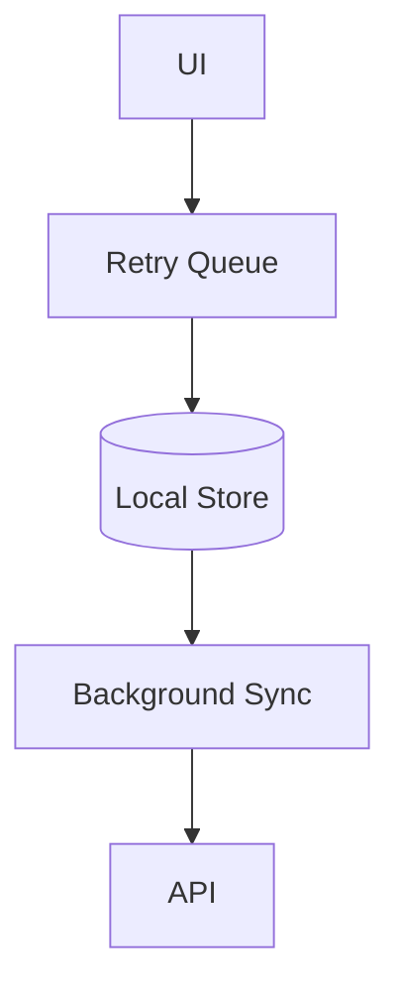
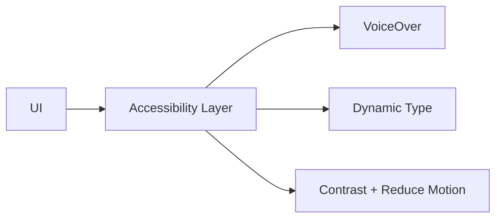
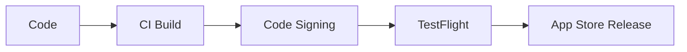
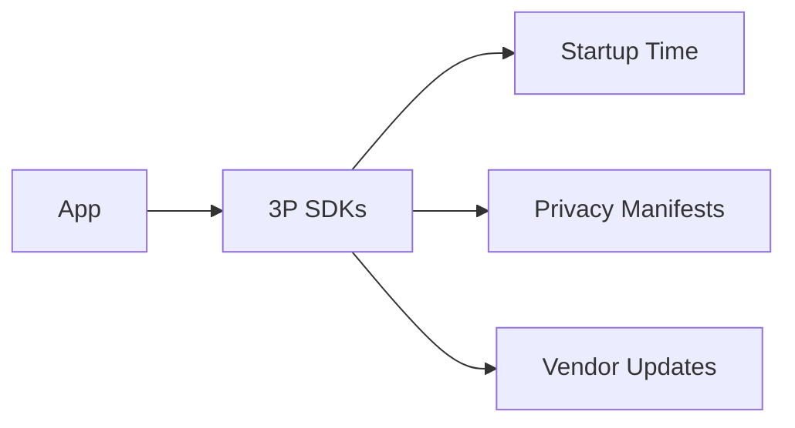

# System Design Challenges (iOS App Nature)

@PageImage(purpose: card, source: "system-design-mermaid-challenges-part-1-ios-app-nature-card.codex", alt: "Placeholder card")
@Image(source: "system-design-mermaid-challenges-part-1-ios-app-nature-hero.codex", alt: "Placeholder hero")
@PageImage(purpose: icon, source: "system-design-mermaid-challenges-part-1-ios-app-nature-icon.codex", alt: "Placeholder icon")

@Metadata {
  @TitleHeading("iOS app nature: 10 challenge diagrams")
  @PageColor(orange)
  @PageImage(purpose: icon, source: "system-design-icon.codex", alt: "System Design icon")
  @PageImage(purpose: card, source: "system-design-card.codex", alt: "System Design card")
}

Use these diagrams to rehearse iOS-specific system design challenges in Part I.

## 1) State Management (iOS)

@Image(source: "system-design-mermaid-challenges-part-1-ios-app-nature-01-1-state-management-ios.codex.svg", alt: "1) State management (iOS) diagram")

## 2) Mistakes Are Hard to Revert (iOS)

@Image(source: "system-design-mermaid-challenges-part-1-ios-app-nature-02-2-mistakes-are-hard-to-revert-ios.codex.svg", alt: "2) Mistakes are hard to revert (iOS) diagram")

## 3) Long Tail of Old App Versions (iOS)

@Image(source: "system-design-mermaid-challenges-part-1-ios-app-nature-03-3-long-tail-of-old-app-versions-ios.codex.svg", alt: "3) Long tail of old app versions (iOS) diagram")

## 4) Deeplinks (iOS)

@Image(source: "system-design-mermaid-challenges-part-1-ios-app-nature-04-4-deeplinks-ios.codex.svg", alt: "4) Deeplinks (iOS) diagram")

## 5) Push + Background Notifications (iOS)

@Image(source: "system-design-mermaid-challenges-part-1-ios-app-nature-05-5-push-background-notifications-ios.codex.svg", alt: "5) Push + background notifications (iOS) diagram")

## 6) App Crashes (iOS)

@Image(source: "system-design-mermaid-challenges-part-1-ios-app-nature-06-6-app-crashes-ios.codex.svg", alt: "6) App crashes (iOS) diagram")

## 7) Offline Support (iOS)

@Image(source: "system-design-mermaid-challenges-part-1-ios-app-nature-07-7-offline-support-ios.codex.svg", alt: "7) Offline support (iOS) diagram")

## 8) Accessibility (iOS)

@Image(source: "system-design-mermaid-challenges-part-1-ios-app-nature-08-8-accessibility-ios.codex.svg", alt: "8) Accessibility (iOS) diagram")

## 9) CI/CD & Build Train (iOS)

@Image(source: "system-design-mermaid-challenges-part-1-ios-app-nature-09-9-ci-cd-build-train-ios.codex.svg", alt: "9) CI/CD & build train (iOS) diagram")

## 10) Third-party Libraries and SDKs (iOS)

@Image(source: "system-design-mermaid-challenges-part-1-ios-app-nature-10-10-third-party-libraries-and-sdks-ios.codex.svg", alt: "10) Third-party libraries and SDKs (iOS) diagram")

