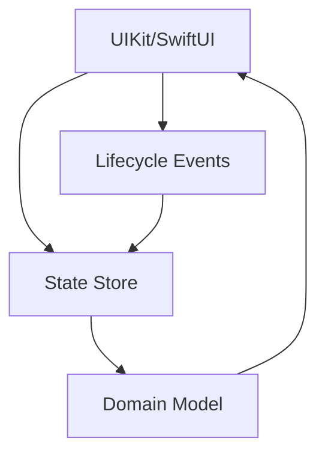
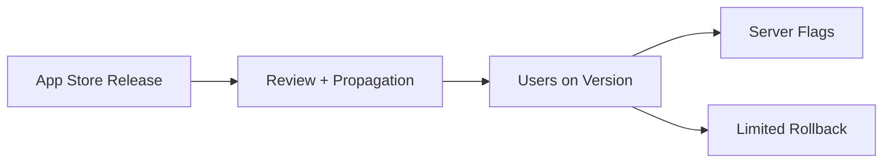
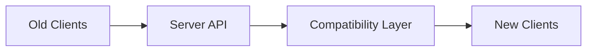
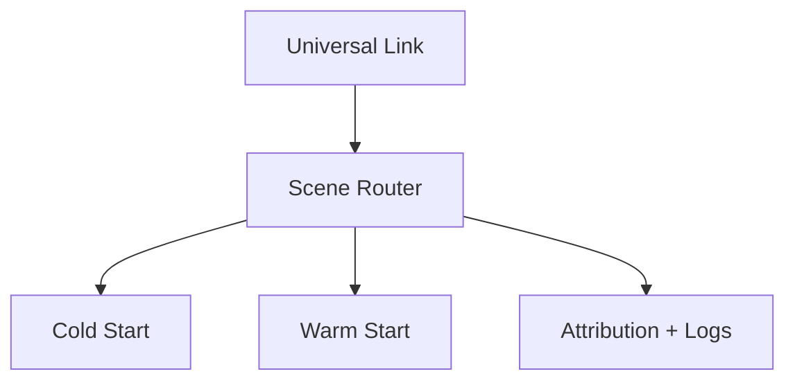
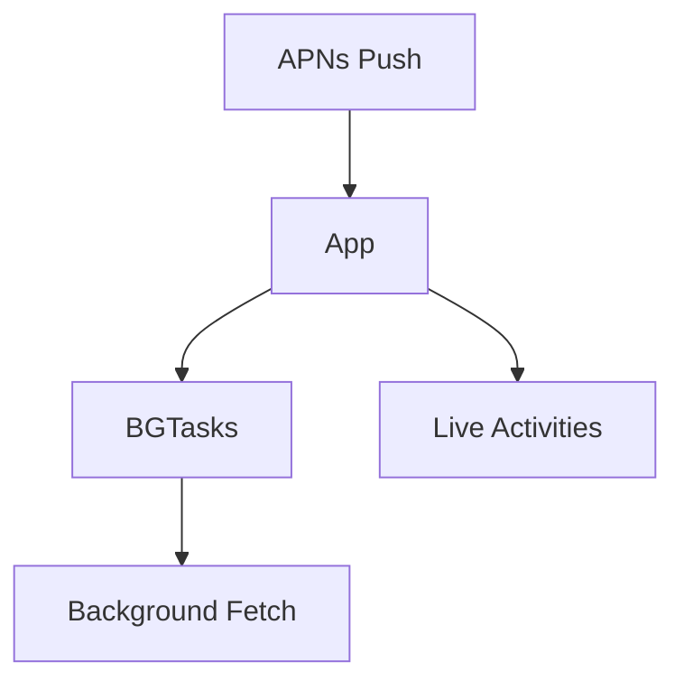
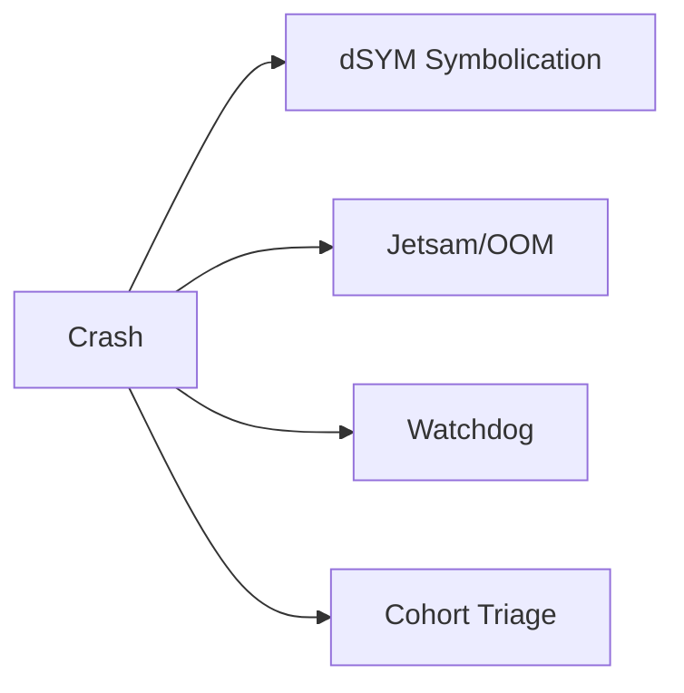
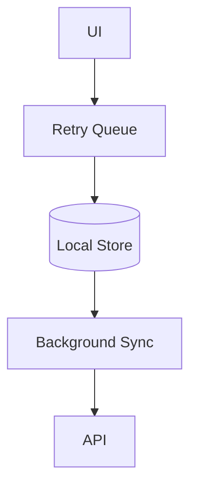
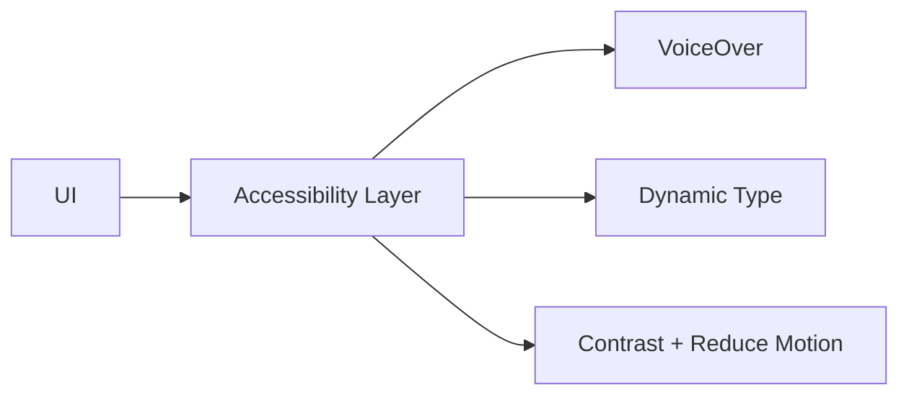
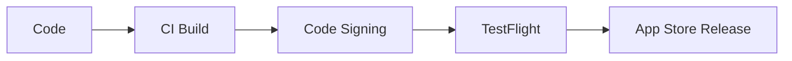
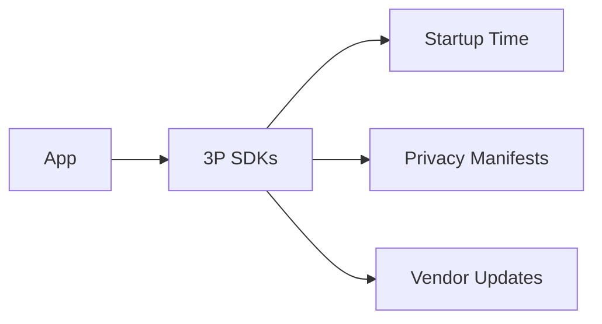

# System Design Challenges (iOS App Nature)

@Metadata {
  @TitleHeading("iOS app nature: 10 challenge diagrams")
  @PageColor(orange)
}

Use these diagrams to rehearse iOS-specific system design challenges in Part I.

## 1) State Management (iOS)

## 2) Mistakes Are Hard to Revert (iOS)

## 3) Long Tail of Old App Versions (iOS)

## 4) Deeplinks (iOS)

## 5) Push + Background Notifications (iOS)

## 6) App Crashes (iOS)

## 7) Offline Support (iOS)

## 8) Accessibility (iOS)

## 9) CI/CD & Build Train (iOS)

## 10) Third-party Libraries and SDKs (iOS)

