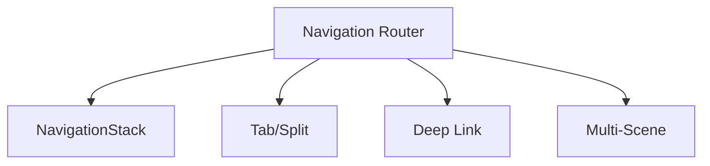
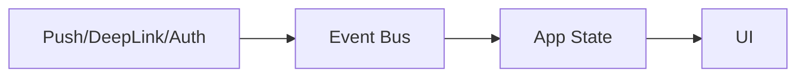
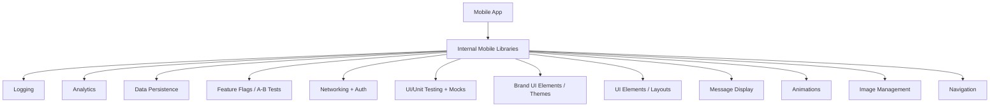
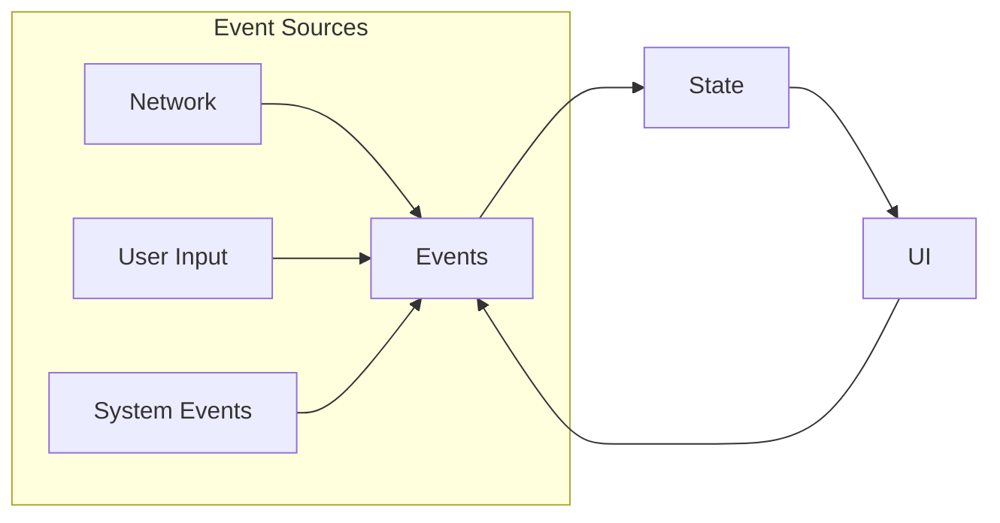
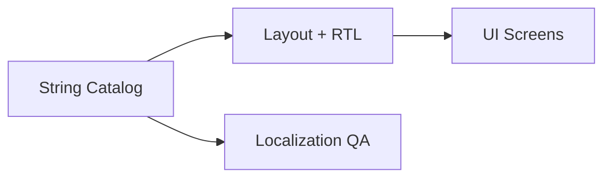
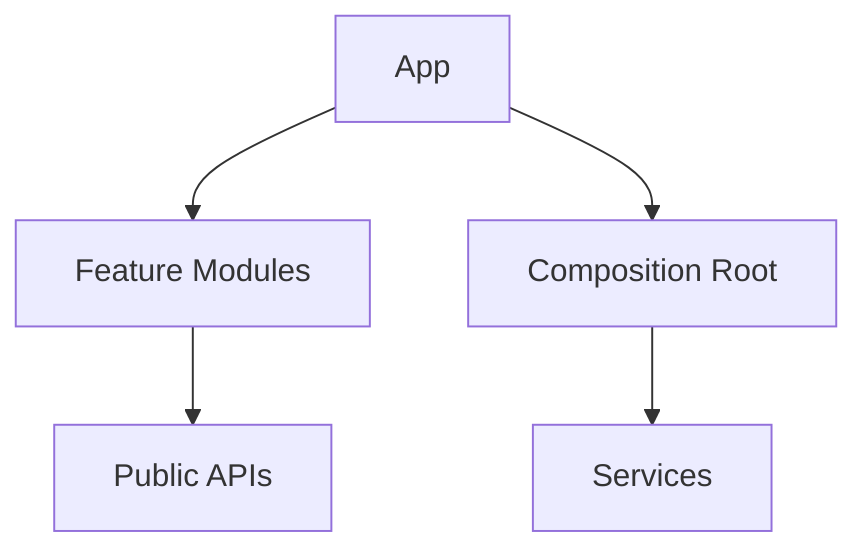
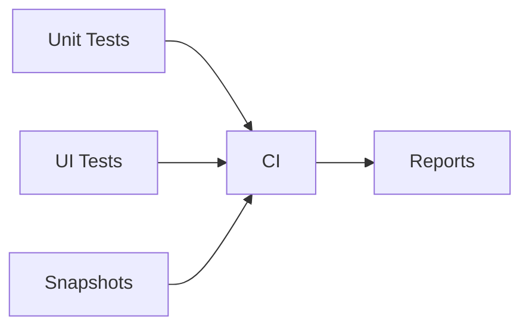
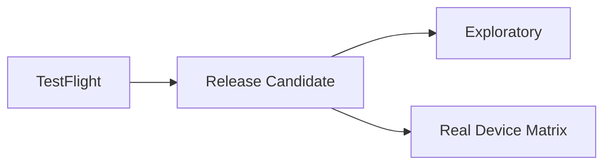
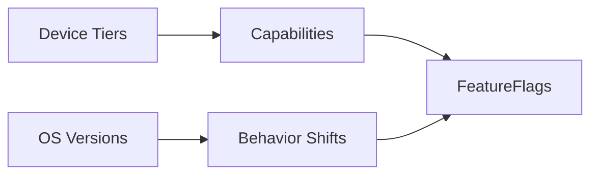

# System Design Challenges (iOS App Complexity)

@Metadata {
  @TitleHeading("iOS complexity: 7 challenge diagrams")
  @PageColor(orange)
}

Use these diagrams to rehearse iOS-specific complexity challenges in Part II.

## 11) Navigation Architecture (Large iOS Apps)

## 12) Application State & Event-driven Changes

## 18) Internal Mobile Libraries (Design System Review)

## 19) Event-driven State Changes (iOS)

## 13) Localization

## 14) Modular Architecture & DI

## 15) Automated Testing (iOS)

## 16) Manual Testing (iOS)

## 17) Device and OS Fragmentation (iOS Flavor)

