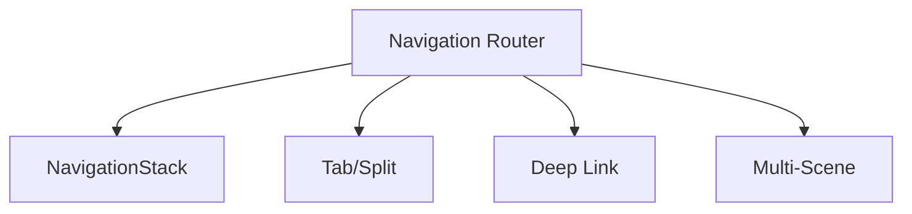
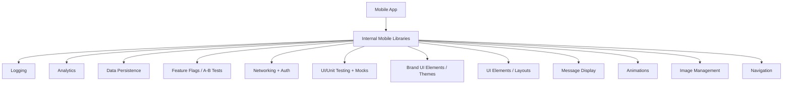
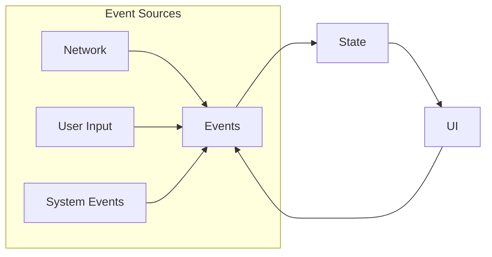
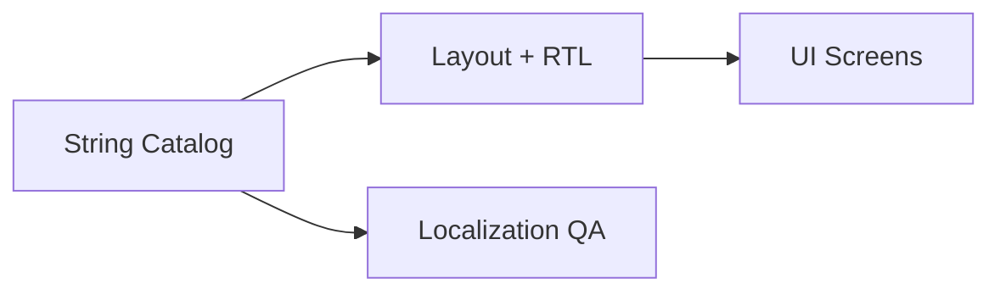
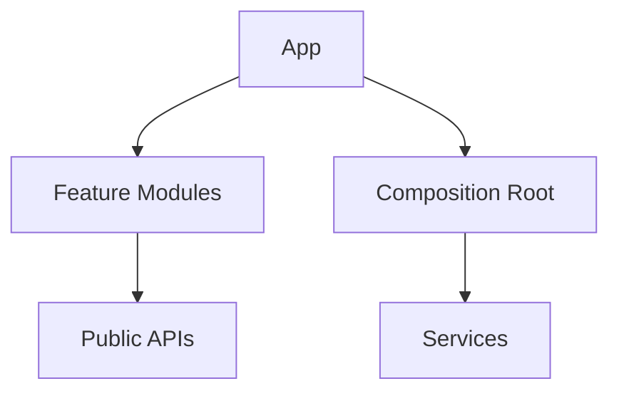
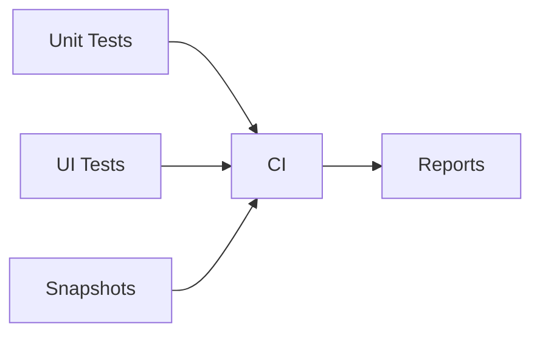
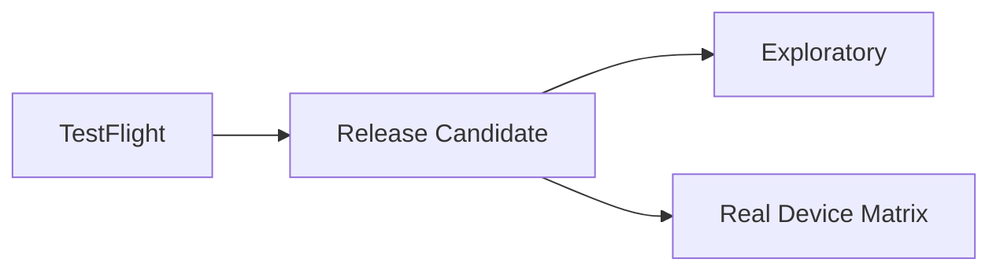
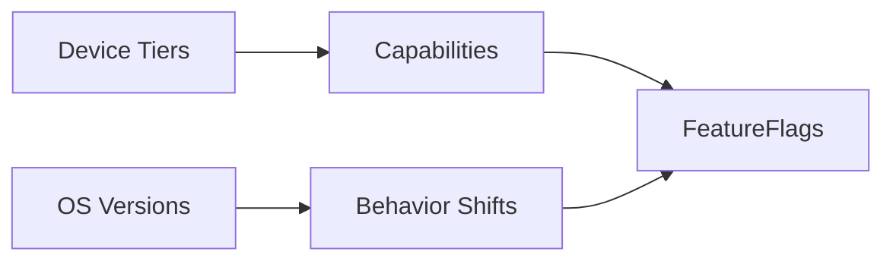

# System Design Challenges (iOS App Complexity)

@PageImage(purpose: card, source: "system-design-mermaid-challenges-part-2-ios-complexity-card.codex", alt: "Placeholder card")
@Image(source: "system-design-mermaid-challenges-part-2-ios-complexity-hero.codex", alt: "Placeholder hero")
@PageImage(purpose: icon, source: "system-design-mermaid-challenges-part-2-ios-complexity-icon.codex", alt: "Placeholder icon")

@Metadata {
  @TitleHeading("iOS complexity: 7 challenge diagrams")
  @PageColor(orange)
  @PageImage(purpose: icon, source: "system-design-icon.codex", alt: "System Design icon")
  @PageImage(purpose: card, source: "system-design-card.codex", alt: "System Design card")
}

Use these diagrams to rehearse iOS-specific complexity challenges in Part II.

## 11) Navigation Architecture (Large iOS Apps)

@Image(source: "system-design-mermaid-challenges-part-2-ios-complexity-01-11-navigation-architecture-large-ios-apps.codex.svg", alt: "11) Navigation architecture (large iOS apps) diagram")

## 12) Application State & Event-driven Changes

@Image(source: "system-design-mermaid-challenges-part-2-ios-complexity-02-12-application-state-event-driven-changes.codex.svg", alt: "12) Application state & event-driven changes diagram")

## 18) Internal Mobile Libraries (Design System Review)

@Image(source: "system-design-mermaid-challenges-part-2-ios-complexity-03-18-internal-mobile-libraries-design-system-review.codex.svg", alt: "18) Internal mobile libraries (design system review) diagram")

## 19) Event-driven State Changes (iOS)

@Image(source: "system-design-mermaid-challenges-part-2-ios-complexity-04-19-event-driven-state-changes-ios.codex.svg", alt: "19) Event-driven state changes (iOS) diagram")

## 13) Localization

@Image(source: "system-design-mermaid-challenges-part-2-ios-complexity-05-13-localization.codex.svg", alt: "13) Localization diagram")

## 14) Modular Architecture & DI

@Image(source: "system-design-mermaid-challenges-part-2-ios-complexity-06-14-modular-architecture-di.codex.svg", alt: "14) Modular architecture & DI diagram")

## 15) Automated Testing (iOS)

@Image(source: "system-design-mermaid-challenges-part-2-ios-complexity-07-15-automated-testing-ios.codex.svg", alt: "15) Automated testing (iOS) diagram")

## 16) Manual Testing (iOS)

@Image(source: "system-design-mermaid-challenges-part-2-ios-complexity-08-16-manual-testing-ios.codex.svg", alt: "16) Manual testing (iOS) diagram")

## 17) Device and OS Fragmentation (iOS Flavor)

@Image(source: "system-design-mermaid-challenges-part-2-ios-complexity-09-17-device-and-os-fragmentation-ios-flavor.codex.svg", alt: "17) Device and OS fragmentation (iOS flavor) diagram")

