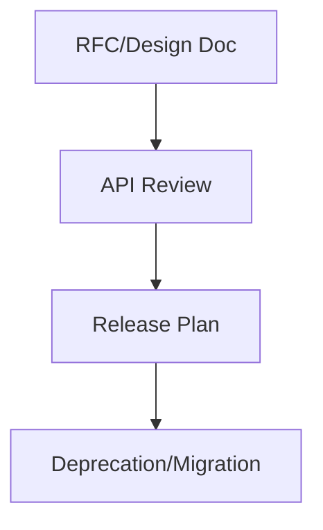
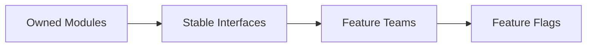
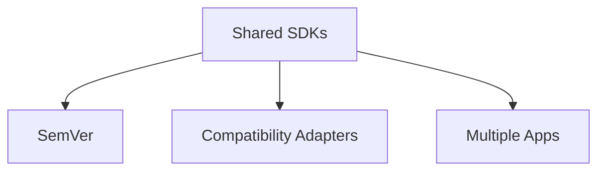
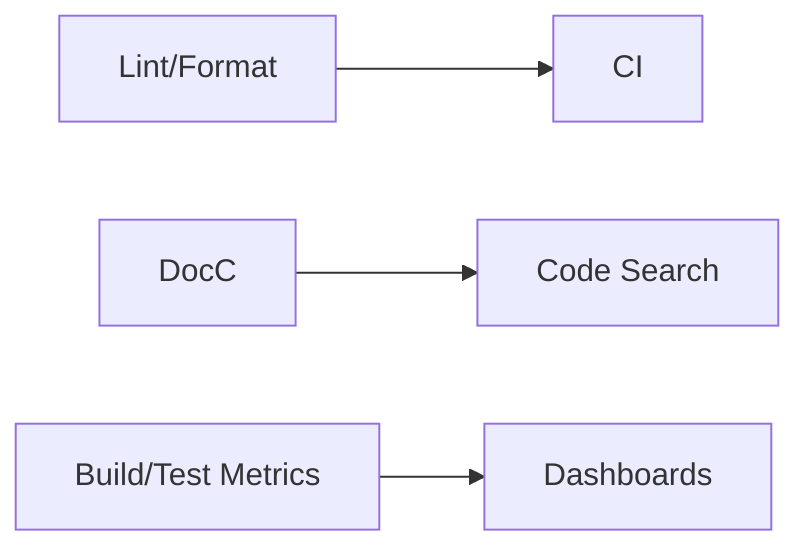
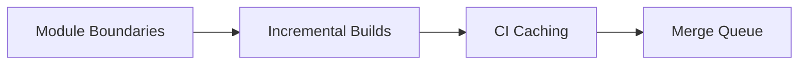
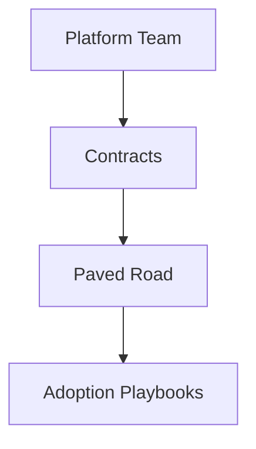

# System Design Challenges (Large iOS Teams)

@Metadata {
  @TitleHeading("Large iOS teams: 7 challenge diagrams")
  @PageColor(orange)
}

Use these diagrams to rehearse large-team challenges in Part III.

## 18) Planning and Decision Making

## 19) Avoid Stepping on Each Other’s Toes

## 20) Shared Architecture Across Apps

## 21) Tooling Maturity

## 22) Scaling Build & Merge Times

## 23) Mobile Platform Libraries and Teams

## 24) In-app Purchases (iOS)

