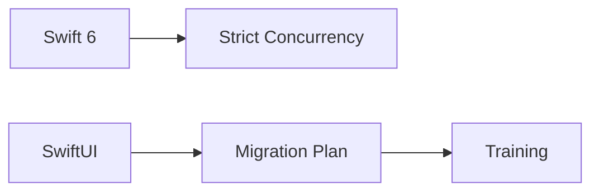
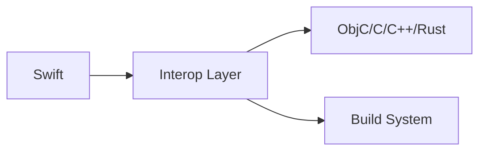
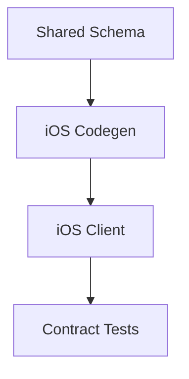
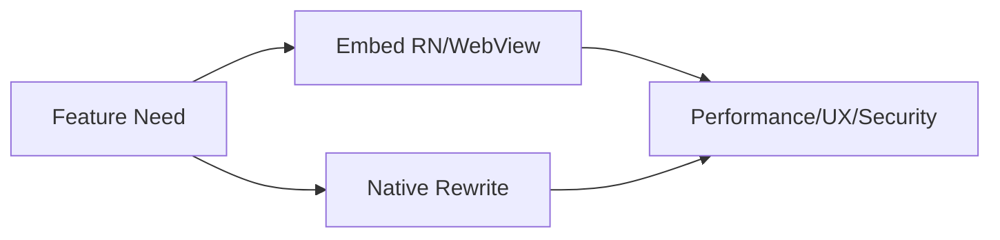
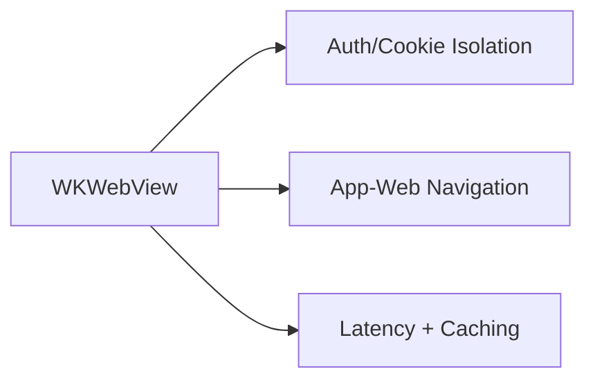

# System Design Challenges (Languages + Cross-platform)

@Metadata {
  @TitleHeading("Languages + cross-platform: 5 challenge diagrams")
  @PageColor(orange)
}

Use these diagrams to rehearse Part IV challenges.

## 25) Adopting New Languages and Frameworks

## 26) Interop Reality (Objective-C/C/C++/Rust)

## 27) Cross-platform Feature Development (iOS-native)

## 28) Cross-platform vs Native Decision

## 29) Web/PWA & Backend-driven Apps

