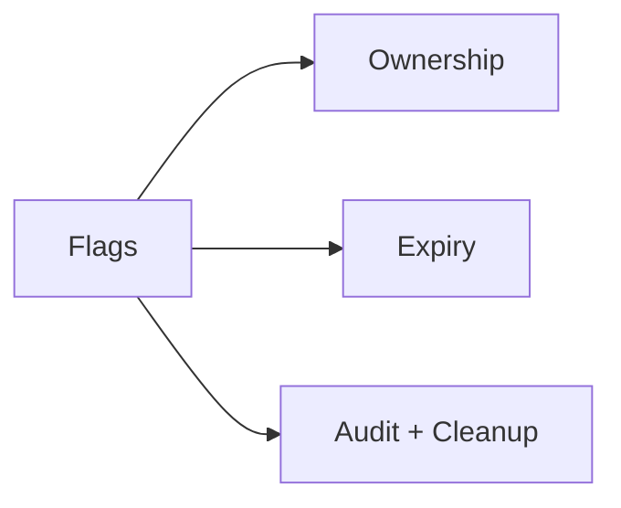
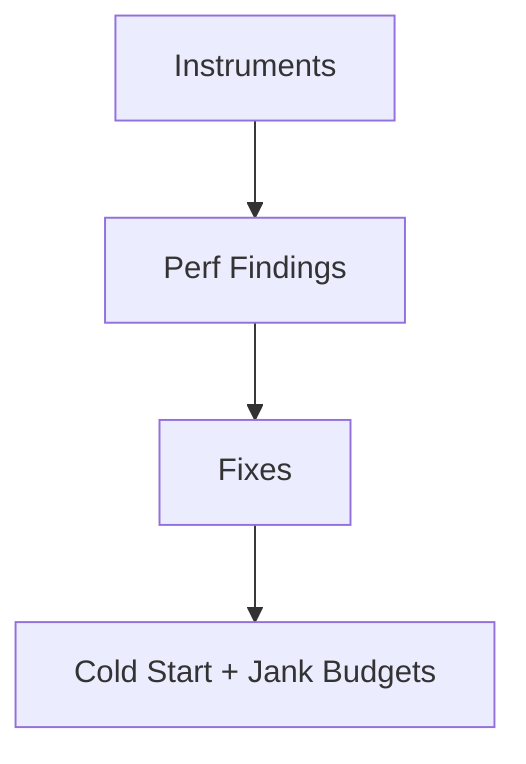
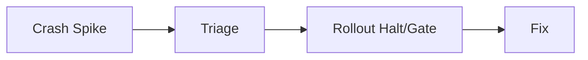
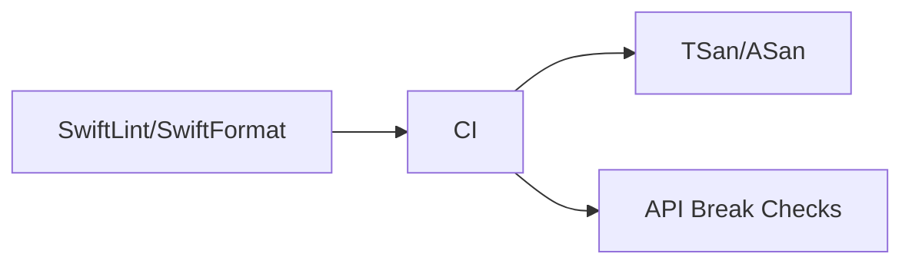
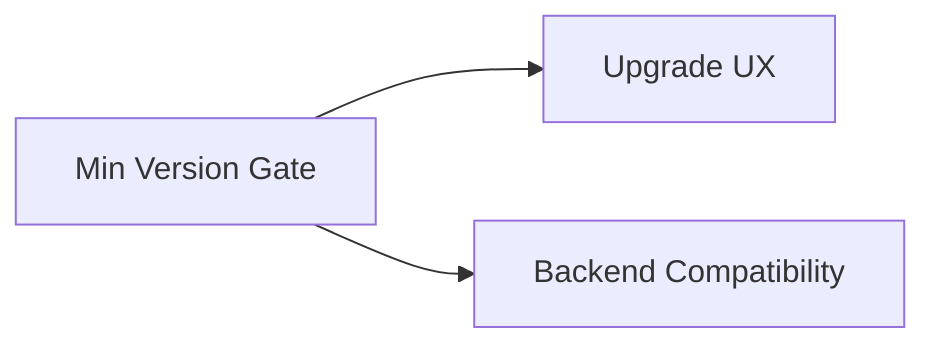
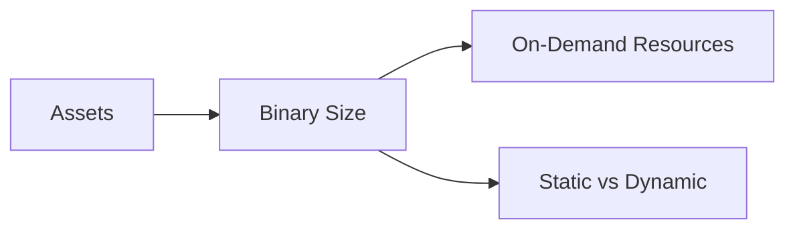

# System Design Challenges (iOS Practice + Scale)

@PageImage(purpose: card, source: "system-design-mermaid-challenges-part-5-ios-practice-card.codex", alt: "Placeholder card")
@Image(source: "system-design-mermaid-challenges-part-5-ios-practice-hero.codex", alt: "Placeholder hero")
@PageImage(purpose: icon, source: "system-design-mermaid-challenges-part-5-ios-practice-icon.codex", alt: "Placeholder icon")

@Metadata {
  @TitleHeading("iOS practice: 10 challenge diagrams")
  @PageColor(orange)
  @PageImage(purpose: icon, source: "system-design-icon.codex", alt: "System Design icon")
  @PageImage(purpose: card, source: "system-design-card.codex", alt: "System Design card")
}

Use these diagrams to rehearse Part V challenges.

## 30) Experimentation (iOS)

@Image(source: "system-design-mermaid-challenges-part-5-ios-practice-01-30-experimentation-ios.codex.svg", alt: "30) Experimentation (iOS) diagram")

## 31) Feature Flag Hell (iOS)

@Image(source: "system-design-mermaid-challenges-part-5-ios-practice-02-31-feature-flag-hell-ios.codex.svg", alt: "31) Feature flag hell (iOS) diagram")

## 32) Performance (iOS)

@Image(source: "system-design-mermaid-challenges-part-5-ios-practice-03-32-performance-ios.codex.svg", alt: "32) Performance (iOS) diagram")

## 33) Analytics, Monitoring, Alerting (iOS)

@Image(source: "system-design-mermaid-challenges-part-5-ios-practice-04-33-analytics-monitoring-alerting-ios.codex.svg", alt: "33) Analytics, monitoring, alerting (iOS) diagram")

## 34) Mobile Oncall (iOS)

@Image(source: "system-design-mermaid-challenges-part-5-ios-practice-05-34-mobile-oncall-ios.codex.svg", alt: "34) Mobile oncall (iOS) diagram")

## 35) Advanced Code Quality Checks (iOS)

@Image(source: "system-design-mermaid-challenges-part-5-ios-practice-06-35-advanced-code-quality-checks-ios.codex.svg", alt: "35) Advanced code quality checks (iOS) diagram")

## 36) Compliance, Privacy, Security (iOS)

@Image(source: "system-design-mermaid-challenges-part-5-ios-practice-07-36-compliance-privacy-security-ios.codex.svg", alt: "36) Compliance, privacy, security (iOS) diagram")

## 37) Client-side Data Migrations (iOS)

@Image(source: "system-design-mermaid-challenges-part-5-ios-practice-08-37-client-side-data-migrations-ios.codex.svg", alt: "37) Client-side data migrations (iOS) diagram")

## 38) Forced Upgrading (iOS)

@Image(source: "system-design-mermaid-challenges-part-5-ios-practice-09-38-forced-upgrading-ios.codex.svg", alt: "38) Forced upgrading (iOS) diagram")

## 39) App Size (iOS)

@Image(source: "system-design-mermaid-challenges-part-5-ios-practice-10-39-app-size-ios.codex.svg", alt: "39) App size (iOS) diagram")

