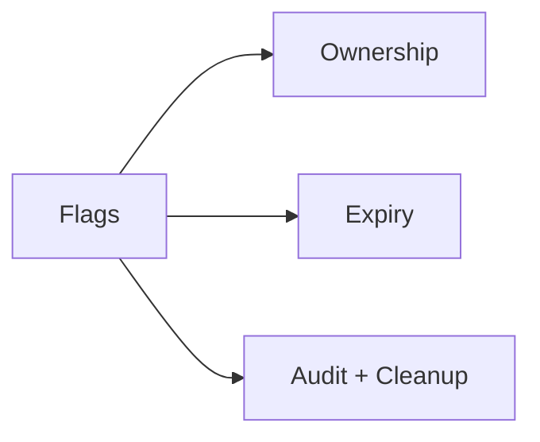
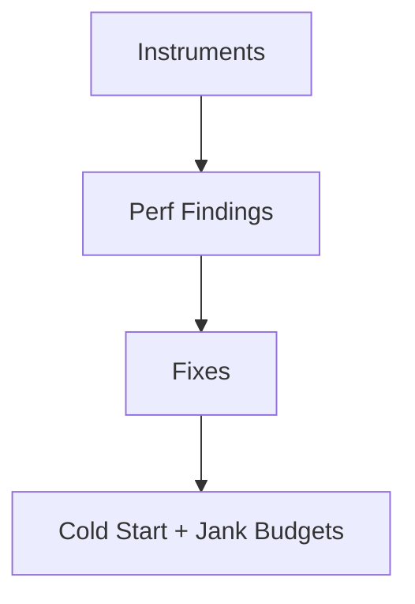
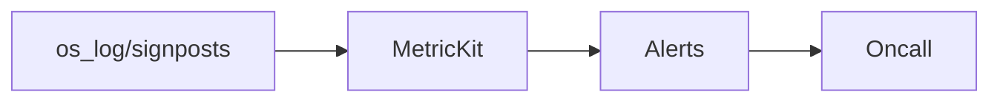
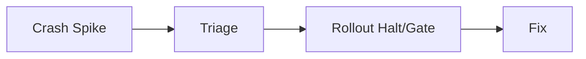
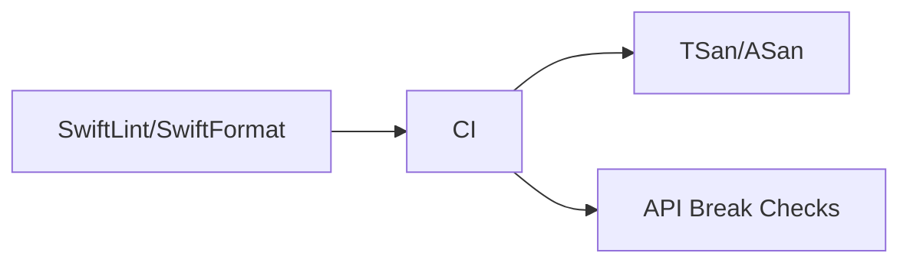
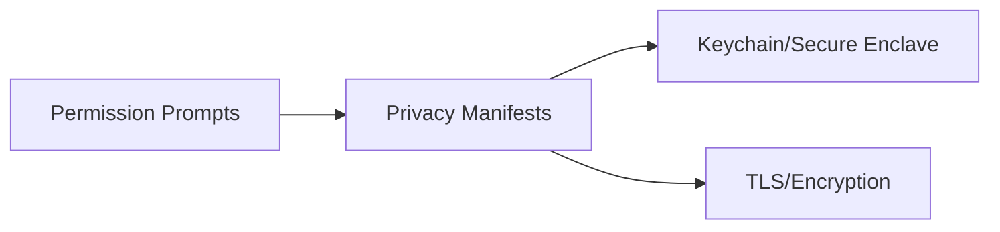
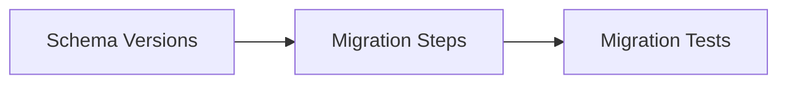
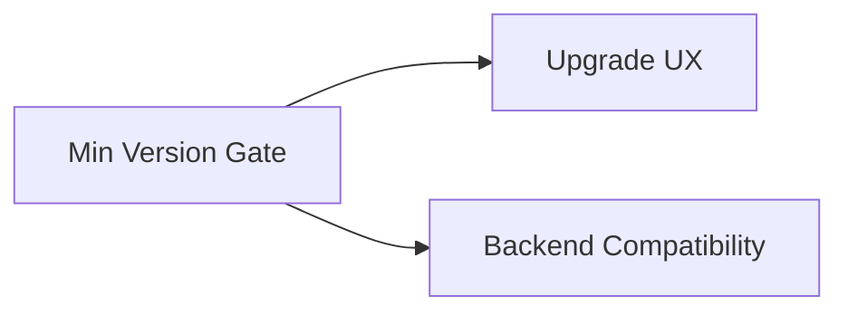
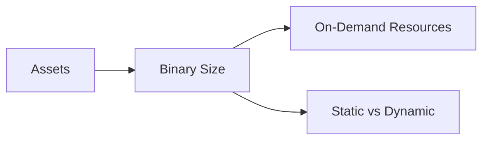

# System Design Challenges (iOS Practice + Scale)

@Metadata {
  @TitleHeading("iOS practice: 10 challenge diagrams")
  @PageColor(orange)
}

Use these diagrams to rehearse Part V challenges.

## 30) Experimentation (iOS)

## 31) Feature Flag Hell (iOS)

## 32) Performance (iOS)

## 33) Analytics, Monitoring, Alerting (iOS)

## 34) Mobile Oncall (iOS)

## 35) Advanced Code Quality Checks (iOS)

## 36) Compliance, Privacy, Security (iOS)

## 37) Client-side Data Migrations (iOS)

## 38) Forced Upgrading (iOS)

## 39) App Size (iOS)

