# Mermaid Class Diagrams (System Design)


@Metadata {
  @TitleHeading("Mermaid class diagrams reference")
  @PageColor(blue)
}

Use this reference for Mermaid class diagrams when modeling object-oriented system design.

## Overview

Class diagrams show classes, attributes, methods, and relationships. Mermaid renders UML-style
class diagrams with a concise syntax.

## Basic Example

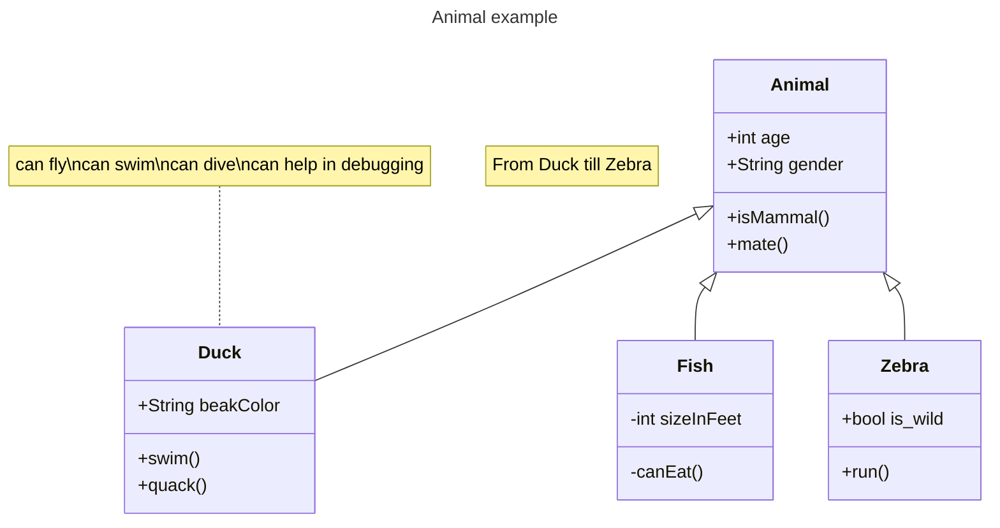


## Class Definition

Define classes either explicitly or via relationships.

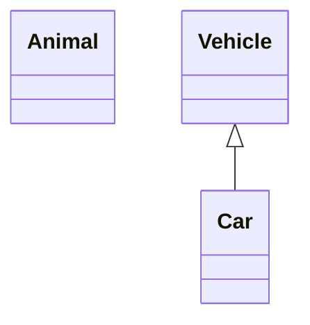


Naming convention: use alphanumeric characters, underscores, and dashes.

## Class Labels

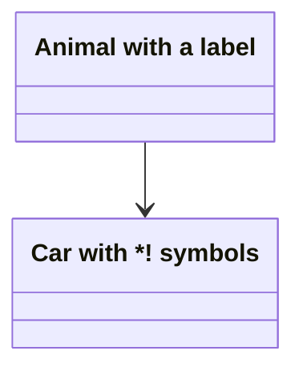


Escape special characters with backticks:

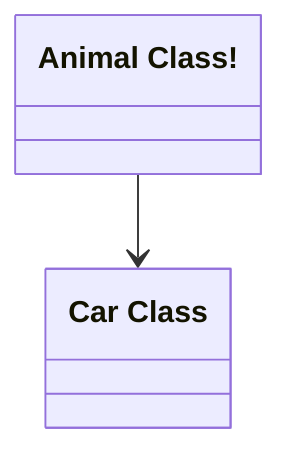


## Members

Use `:` for one member at a time:

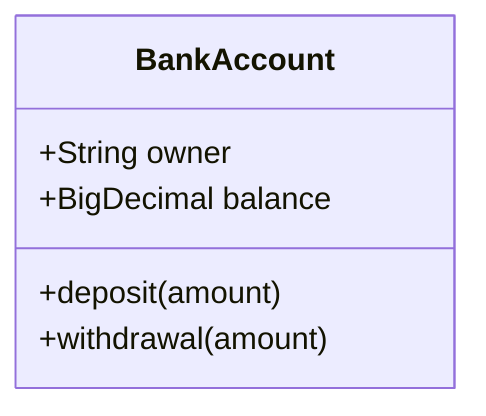


Use `{}` to group members:


### Return Types

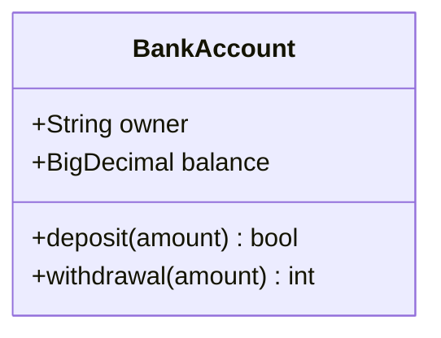


### Generic Types

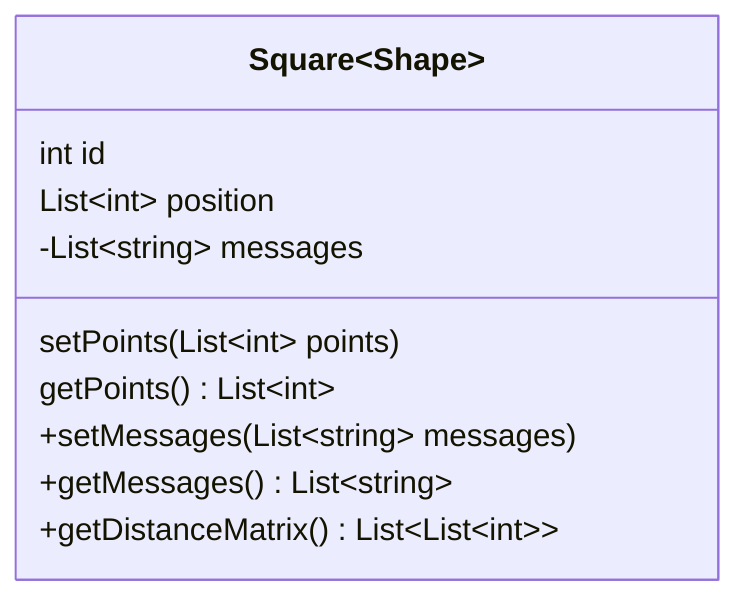


## Visibility and Classifiers

Visibility:

- `+` Public
- `-` Private
- `#` Protected
- `~` Package/Internal

Classifiers:

- `*` Abstract
- `$` Static

## Relationships

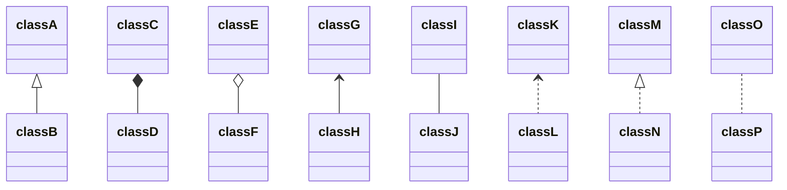


With labels:

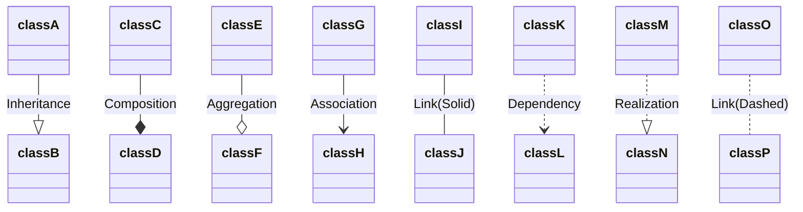


### Lollipop Interfaces

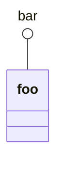


## Namespaces

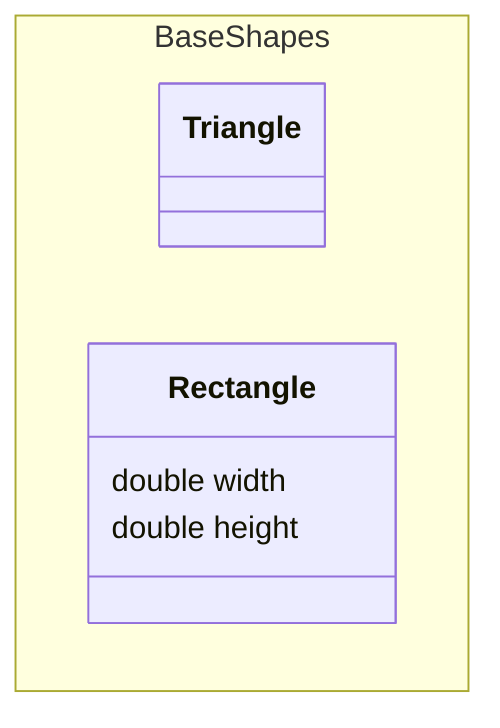


## Cardinality Multiplicity

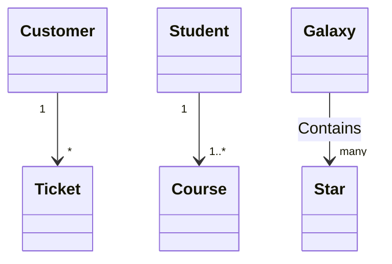


## Annotations

Inline annotations are not supported by every Mermaid renderer. Use the separate line form for
maximum compatibility:

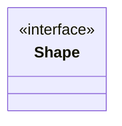


Nested:

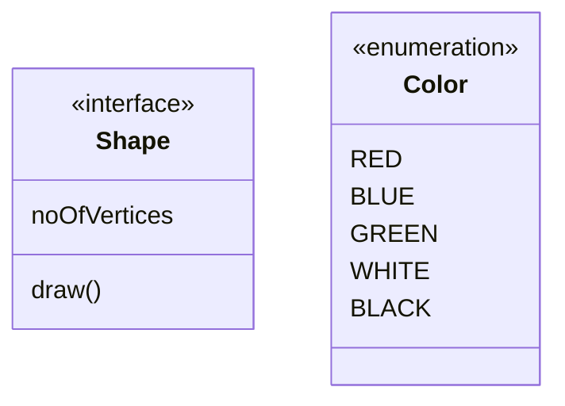


## Notes

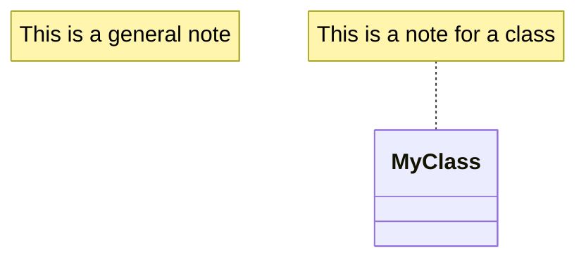


## Direction

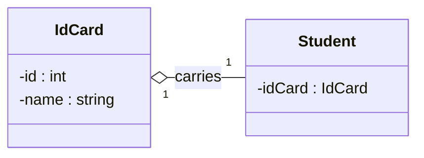


## Interaction

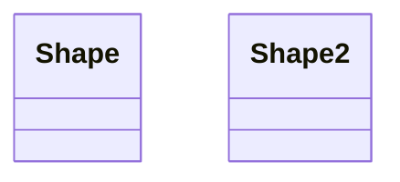


## Styling

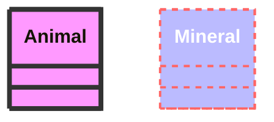


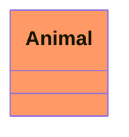


Default class:

```mermaid
classDiagram
  class Animal:::pink
  class Mineral

  classDef default fill:#f96,color:red
  classDef pink color:#f9f
```


## Configuration

Hide empty members box:

```mermaid
---
config:
  class:
    hideEmptyMembersBox: true
---
classDiagram
  class Duck
```


