# Mermaid Flowcharts (System Design)


@Metadata {
  @TitleHeading("Mermaid flowcharts reference")
  @PageColor(blue)
}

Use this reference for the valid Mermaid flowchart shapes and syntax when building system design
interview diagrams.

## Flowcharts - Basic Syntax

Flowcharts are composed of nodes (geometric shapes) and edges (arrows or lines). Mermaid code
controls node shapes, edge types, and subgraph grouping.

### Warnings

- If you use the word "end" in a node label, capitalize it ("End" or "END") to avoid breaking the
  diagram.
- If a node label starts with "o" or "x", add a leading space or capitalize the letter (for
  example, " dev---ops" or "dev---Ops").
- Typing "A---oB" creates a circle edge. Typing "A---xB" creates a cross edge.

## Nodes

### Default Node

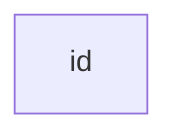


### Node with Text

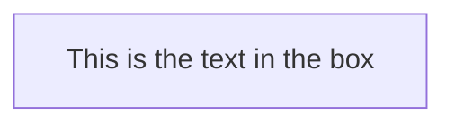


### Unicode Text

Use double quotes around the label.

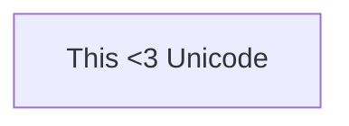


### Markdown Formatting

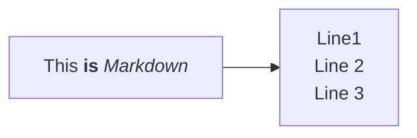


## Direction

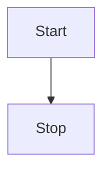


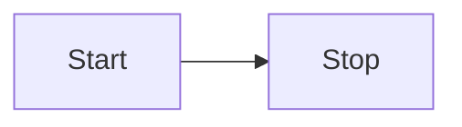


Valid orientations: `TB`, `TD`, `BT`, `RL`, `LR`.

## Classic Node Shapes

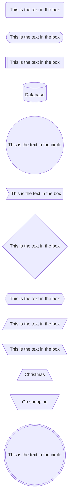


## Expanded Node Shapes (Mermaid V11.3.0+)

Mermaid supports a general shape syntax for expanded shapes:

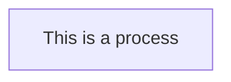


### Shape List (Short Names)

| Semantic name | Short name | Description | Aliases |
| --- | --- | --- | --- |
| Bang | bang | Bang | bang |
| Card | notch-rect | Notched rectangle | card, notched-rectangle |
| Cloud | cloud | Cloud | cloud |
| Collate | hourglass | Collate operation | collate, hourglass |
| Com Link | bolt | Communication link | com-link, lightning-bolt |
| Comment | brace-l | Comment (left) | brace-l, comment |
| Comment Right | brace-r | Comment (right) | brace-r |
| Comment Both | braces | Comment (both sides) | braces |
| Data In/Out | lean-r | Input or output | in-out, lean-right |
| Data Out/In | lean-l | Output or input | lean-left, out-in |
| Database | cyl | Database | cylinder, database, db |
| Decision | diam | Decision | decision, diamond, question |
| Delay | delay | Delay | half-rounded-rectangle |
| Direct Access Storage | h-cyl | Direct access storage | das, horizontal-cylinder |
| Disk Storage | lin-cyl | Disk storage | disk, lined-cylinder |
| Display | curv-trap | Display | curved-trapezoid, display |
| Divided Process | div-rect | Divided process | div-proc, divided-process |
| Document | doc | Document | doc, document |
| Event | rounded | Event | event |
| Extract | tri | Extract | extract, triangle |
| Fork/Join | fork | Fork or join | join |
| Internal Storage | win-pane | Internal storage | internal-storage, window-pane |
| Junction | f-circ | Junction | filled-circle, junction |
| Lined Document | lin-doc | Lined document | lined-document |
| Lined Process | lin-rect | Lined process | lin-proc, lined-process, shaded-process |
| Loop Limit | notch-pent | Loop limit | loop-limit, notched-pentagon |
| Manual File | flip-tri | Manual file | flipped-triangle, manual-file |
| Manual Input | sl-rect | Manual input | manual-input, sloped-rectangle |
| Manual Operation | trap-t | Manual operation | inv-trapezoid, manual |
| Multi-Document | docs | Multiple documents | documents, st-doc, stacked-document |
| Multi-Process | st-rect | Multiple processes | processes, procs, stacked-rectangle |
| Odd | odd | Odd shape | odd |
| Paper Tape | flag | Paper tape | paper-tape |
| Prepare Conditional | hex | Prepare conditional | hexagon, prepare |
| Priority Action | trap-b | Priority action | priority, trapezoid-bottom |
| Process | rect | Process | proc, process, rectangle |
| Start | circle | Start | circ |
| Start (small) | sm-circ | Small start | small-circle, start |
| Stop | dbl-circ | Stop | double-circle |
| Stop (framed) | fr-circ | Stop | framed-circle, stop |
| Stored Data | bow-rect | Stored data | bow-tie-rectangle, stored-data |
| Subprocess | fr-rect | Subprocess | framed-rectangle, subproc, subroutine |
| Summary | cross-circ | Summary | crossed-circle, summary |
| Tagged Document | tag-doc | Tagged document | tagged-document |
| Tagged Process | tag-rect | Tagged process | tag-proc, tagged-rectangle |
| Terminal Point | stadium | Terminal point | pill, terminal |
| Text Block | text | Text block | text |

## Special Shapes (Icon, Image)

### Icon

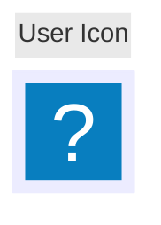


Parameters: `icon`, `form` (square, circle, rounded), `label`, `pos` (t, b), `h`.

### Image

```mermaid
flowchart TD
    A@{ img: "https://mermaid.js.org/favicon.svg", label: "Image Label", pos: "t", h: 60, constraint: "on" }
```


Parameters: `img`, `label`, `pos`, `w`, `h`, `constraint` (on, off).

## Links Between Nodes

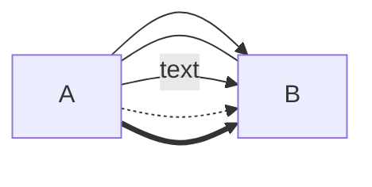


Circle and cross edges:

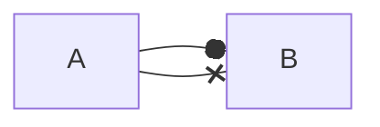


Multi-directional arrows:

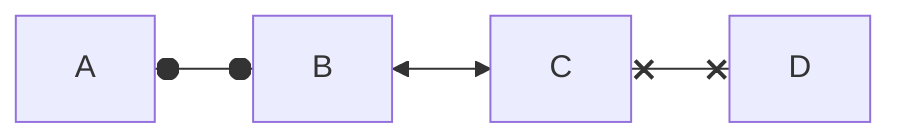


### Edge IDs and Animation


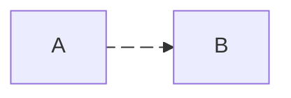


## Subgraphs

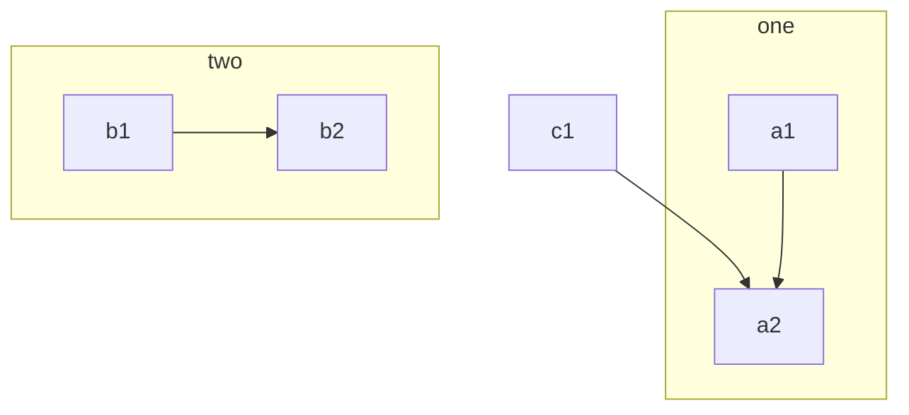


Direction inside subgraphs:

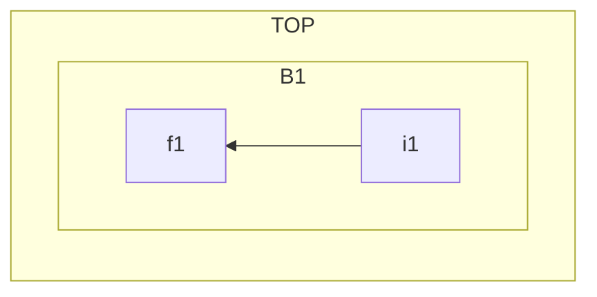


Note: if a subgraph has links to nodes outside it, it inherits the parent direction.

## Markdown Strings

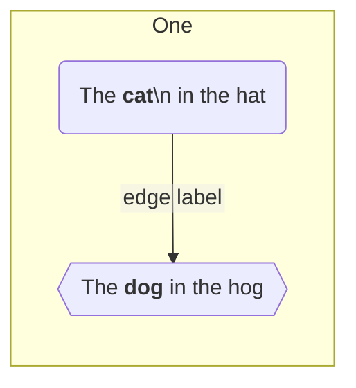


Disable auto wrapping:

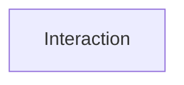


## Interaction

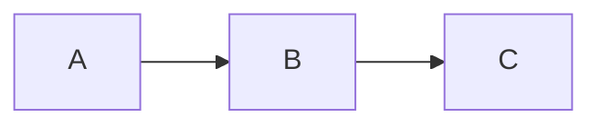


Links open in the same tab by default. Use `_blank` to open new tabs.

## Styling and Classes

```mermaid
flowchart LR
    id1(Start)-->id2(Stop)
    style id1 fill:#f9f,stroke:#333,stroke-width:4px
    style id2 fill:#bbf,stroke:#f66,stroke-width:2px,color:#fff,stroke-dasharray: 5 5
```


```mermaid
flowchart LR
    A:::someclass --> B
    classDef someclass fill:#f96
```


## Configuration

Default renderer is `dagre`. Use `elk` for larger graphs (Mermaid 9.4+):

```yaml
config:
  flowchart:
    defaultRenderer: "elk"
```
