# System Design Mermaid Prompts

@Metadata {
  @TitleHeading("Sketch fast, explain tradeoffs")
  @PageColor(red)
}

Use these quick Mermaid prompts to sketch **mobile iOS** system design answers in Excalidraw.
Each prompt targets the highest-signal architecture and tradeoffs in minutes, with Meta
product variants (Instagram, WhatsApp, Facebook) in mind.

See the Mermaid references:
- `system-design-mermaid-flowcharts.md`
- `system-design-mermaid-class-diagrams.md`
- `system-design-mermaid-sequence-diagrams.md`

## Shape References

Use these when you need standard database shapes or diagonal relationship references.

### Database (Flowchart)

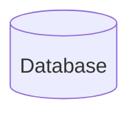

### Database (Expanded Shape)

### Diagonal Relationship References (Class Diagrams)

Use relationship arrows to convey structure quickly:

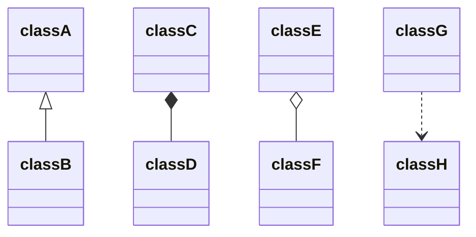

## Rules of Thumb

- Use CamelCase node labels without spaces (for example, `UserSession`, `FeedRanker`).
- Keep each diagram to five nodes or fewer.
- Start with the smallest graph that explains the end-to-end flow.
- Name edges with verbs so reviewers follow the data path.
- Keep device services visible (local store, keychain, push, background tasks).

## Prompt 1: Framework Stack

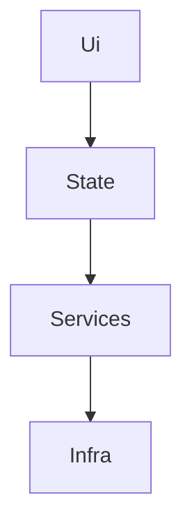

Use for: layered architecture and separation of concerns.

Meta flavor:

- Instagram: UI = Feed, State = FeedStore, Services = FeedService, Infra = Networking.
- WhatsApp: UI = ChatView, State = ThreadStore, Services = MessageService, Infra = Transport.
- Facebook: UI = Timeline, State = StoryStore, Services = RankingService, Infra = APIClient.

## Prompt 2: Protocol Boundary

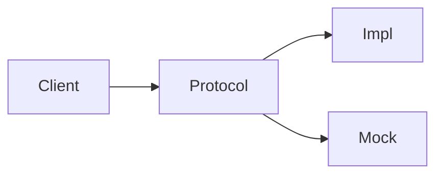

Use for: testability, dependency injection, and clean interfaces.

Meta flavor:

- Instagram: Protocol = MediaUploadClient (real vs mock).
- WhatsApp: Protocol = MessageTransport (real vs mock).
- Facebook: Protocol = FeedRankingClient (real vs mock).

## Prompt 3: Simple API Flow

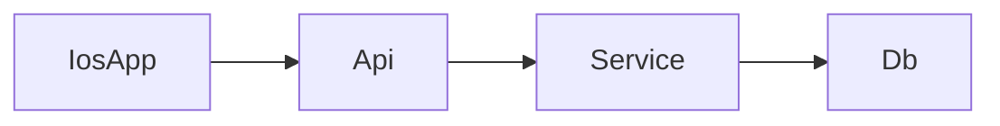

Use for: basic client-server interactions and persistence.

Meta flavor:

- Instagram: PostCreate -> MediaService -> PostDB.
- WhatsApp: SendMessage -> ChatService -> MessageDB.
- Facebook: CreateStory -> StoryService -> StoryDB.

## Prompt 4: Storing Data (Offline)

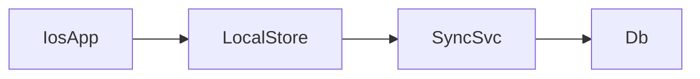

Use for: offline-first writes and background sync.

Meta flavor:

- Instagram: Drafts and edits in LocalStore, SyncSvc uploads when online.
- WhatsApp: Outbox queue in LocalStore, SyncSvc retries delivery.
- Facebook: Draft posts in LocalStore, SyncSvc publishes when online.

## Prompt 5: Media Upload Pipeline

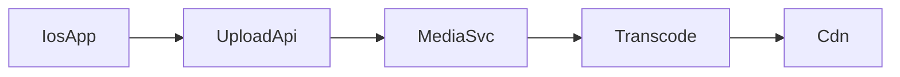

Use for: uploads, transcoding, and distribution.

Meta flavor:

- Instagram: Reels upload -> Transcode -> CDN delivery.
- WhatsApp: Media upload -> Transcode -> CDN fetch.
- Facebook: Video upload -> Transcode -> CDN playback.

## Prompt 6: Push Notifications

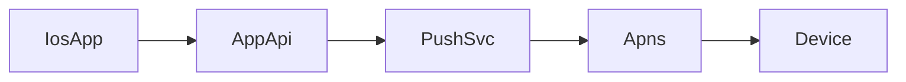

Use for: delivery fanout, device tokens, and platform transport.

Meta flavor:

- Instagram: Likes/comments send push events to APNS.
- WhatsApp: New message sends a push when app is inactive.
- Facebook: Mentions or reactions trigger notification delivery.

## Prompt 7: Realtime Messaging

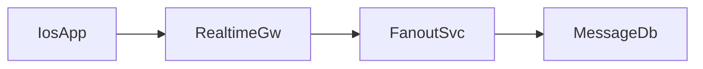

Use for: low-latency transport, fanout, and persistence.

Meta flavor:

- Instagram: Thread replies fan out to participants.
- WhatsApp: Message delivery with fanout + storage.
- Facebook: Messenger threads update in realtime.

## Prompt 8: Feed Ranking

Use for: feed ordering, scoring, and cache strategy.

Meta flavor:

- Instagram: Ranker scores posts for feed.
- WhatsApp: Status ordering uses recency + interactions.
- Facebook: News Feed scoring writes to cache.

## Prompt 9: Auth + Session Refresh

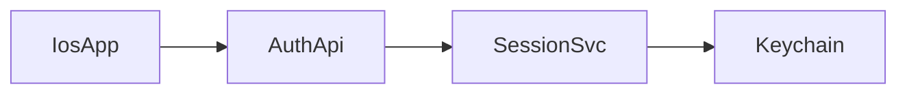

Use for: login, token refresh, and session storage.

Meta flavor:

- Instagram: AuthApi issues tokens, SessionSvc refreshes, Keychain stores.
- WhatsApp: SessionSvc handles re-auth for message sync.
- Facebook: SessionSvc enforces logout + token rotation.

## Prompt 10: Rate Limiting + Backoff

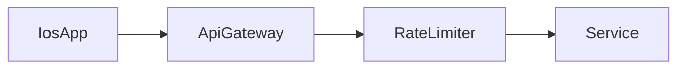

Use for: request throttling, backoff, and abuse control.

Meta flavor:

- Instagram: Rate limit likes/comments and media uploads.
- WhatsApp: Rate limit message sends and media retries.
- Facebook: Rate limit feed refresh and reactions.

## Prompt 11: Search + Explore

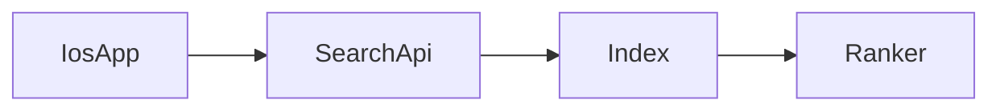

Use for: query flow, indexing, and ranking.

Meta flavor:

- Instagram: Explore search hits index + ranker.
- WhatsApp: Contact/group search uses index + ranker.
- Facebook: Graph search uses index + ranker.

## Prompt 12: Media Playback Pipeline

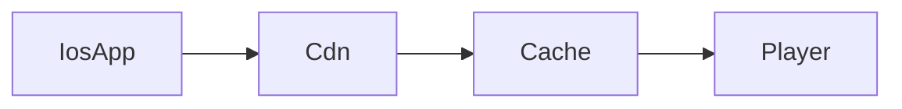

Use for: playback flow, caching, and buffering.

Meta flavor:

- Instagram: Reels playback uses CDN + local cache.
- WhatsApp: Media playback uses cache before download.
- Facebook: Video feed uses CDN + player buffering.
