# Mermaid Sequence Diagrams (System Design)

@PageImage(purpose: card, source: "system-design-mermaid-sequence-diagrams-card.codex", alt: "Placeholder card")
@Image(source: "system-design-mermaid-sequence-diagrams-hero.codex", alt: "Placeholder hero")
@PageImage(purpose: icon, source: "system-design-mermaid-sequence-diagrams-icon.codex", alt: "Placeholder icon")

@Metadata {
  @TitleHeading("Mermaid sequence diagrams reference")
  @PageColor(blue)
  @PageImage(purpose: icon, source: "system-design-icon.codex", alt: "System Design icon")
  @PageImage(purpose: card, source: "system-design-card.codex", alt: "System Design card")
}

Use this reference for Mermaid sequence diagrams when modeling interactions and message flow.

## Overview

Sequence diagrams show how processes operate together over time, including ordering, message
semantics, and participant roles.

## Basic Example

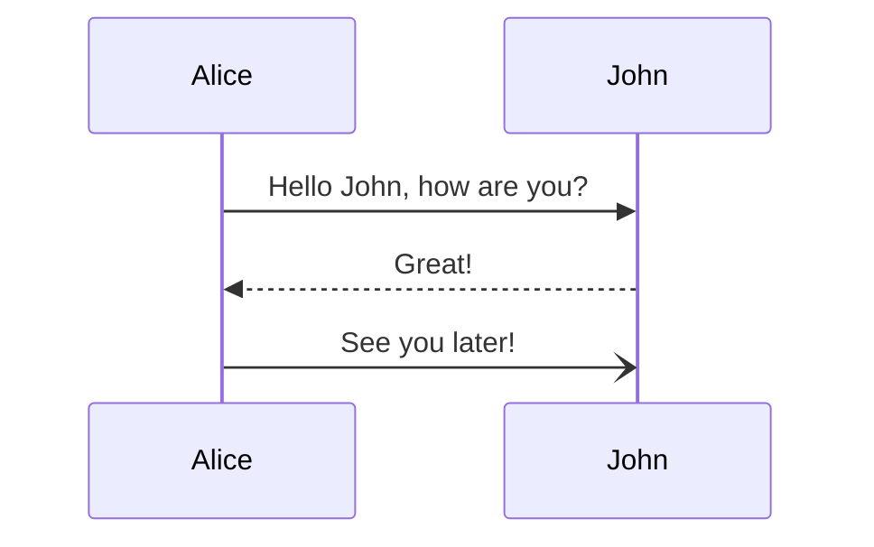
```mermaid
sequenceDiagram
    Alice->>John: Hello John, how are you?
    John-->>Alice: Great!
    Alice-)John: See you later!
```

@Image(source: "system-design-mermaid-sequence-diagrams-01-basic-example.codex.svg", alt: "Basic example diagram")


## Warning

If you use the word "end" in a node label, wrap it in parentheses, quotes, or brackets, e.g.
"(end)", "[end]", or "{end}".

## Participants

Participants can be defined explicitly to control ordering.

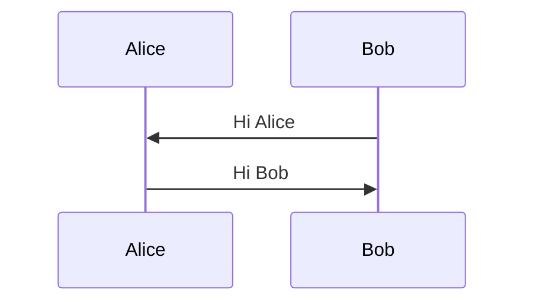
```mermaid
sequenceDiagram
    participant Alice
    participant Bob
    Bob->>Alice: Hi Alice
    Alice->>Bob: Hi Bob
```

@Image(source: "system-design-mermaid-sequence-diagrams-02-participants.codex.svg", alt: "Participants diagram")


### Actors

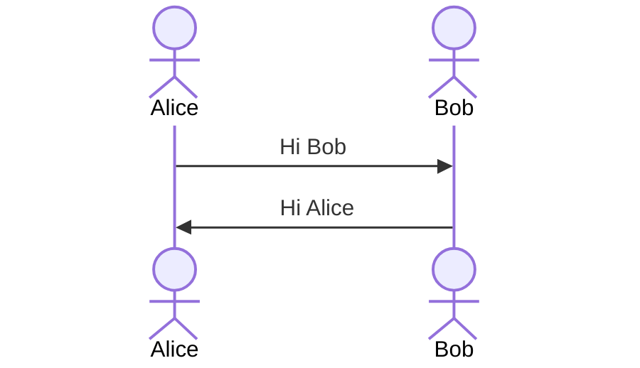
```mermaid
sequenceDiagram
    actor Alice
    actor Bob
    Alice->>Bob: Hi Bob
    Bob->>Alice: Hi Alice
```

@Image(source: "system-design-mermaid-sequence-diagrams-03-participants.codex.svg", alt: "Participants diagram")


### Participant Types

Use JSON config syntax for boundary, control, entity, database, collections, or queue.

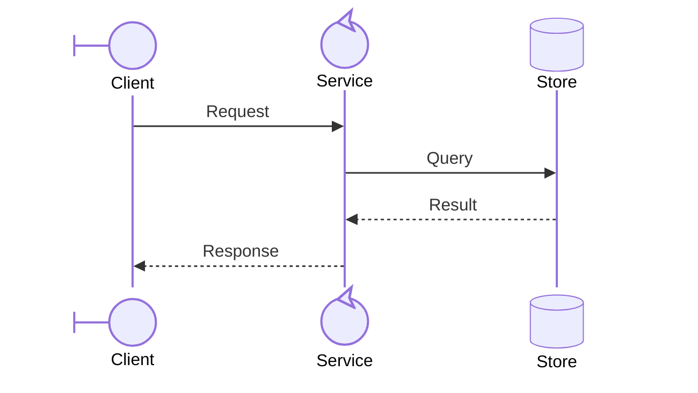
```mermaid
sequenceDiagram
    participant Client@{ "type" : "boundary" }
    participant Service@{ "type" : "control" }
    participant Store@{ "type" : "database" }
    Client->>Service: Request
    Service->>Store: Query
    Store-->>Service: Result
    Service-->>Client: Response
```

@Image(source: "system-design-mermaid-sequence-diagrams-04-participants.codex.svg", alt: "Participants diagram")


### Aliases

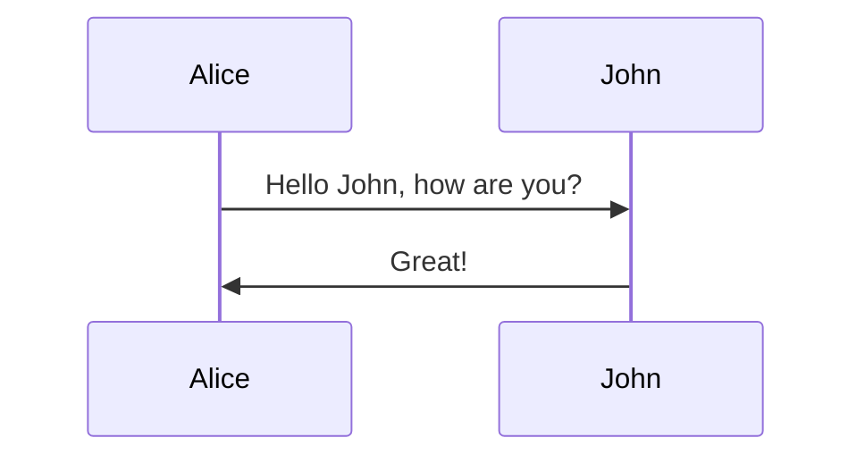
```mermaid
sequenceDiagram
    participant A as Alice
    participant J as John
    A->>J: Hello John, how are you?
    J->>A: Great!
```

@Image(source: "system-design-mermaid-sequence-diagrams-05-participants.codex.svg", alt: "Participants diagram")


## Actor Creation and Destruction (V10.3.0+)

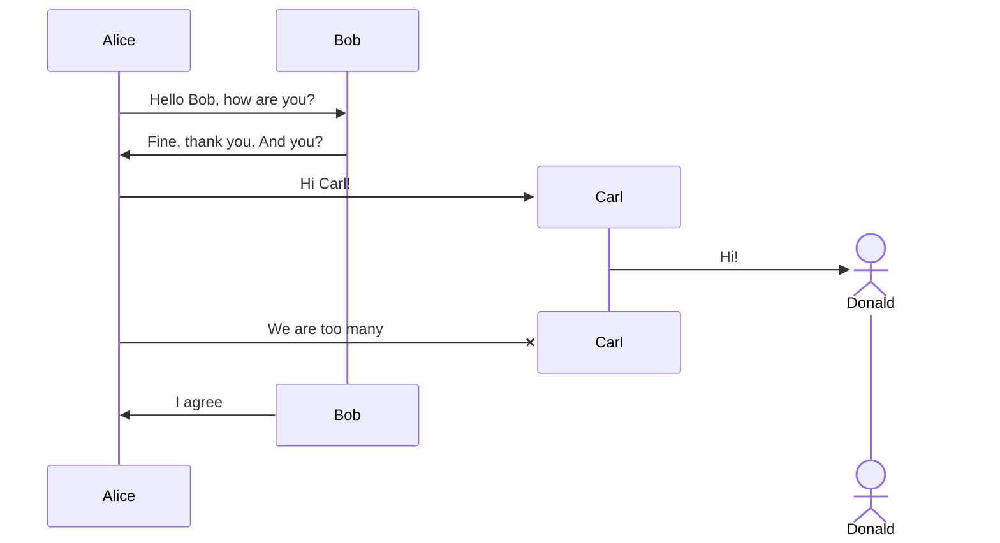
```mermaid
sequenceDiagram
    Alice->>Bob: Hello Bob, how are you?
    Bob->>Alice: Fine, thank you. And you?
    create participant Carl
    Alice->>Carl: Hi Carl!
    create actor D as Donald
    Carl->>D: Hi!
    destroy Carl
    Alice-xCarl: We are too many
    destroy Bob
    Bob->>Alice: I agree
```

@Image(source: "system-design-mermaid-sequence-diagrams-06-actor-creation-and-destruction-v10-3-0.codex.svg", alt: "Actor creation and destruction (v10.3.0+) diagram")


## Grouping Boxes

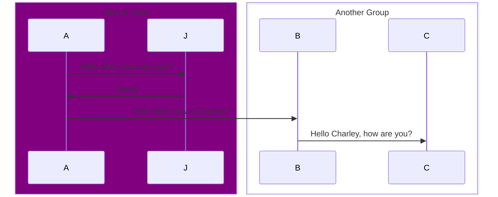
```mermaid
sequenceDiagram
    box Purple Alice & John
    participant A
    participant J
    end
    box Another Group
    participant B
    participant C
    end
    A->>J: Hello John, how are you?
    J->>A: Great!
    A->>B: Hello Bob, how is Charley?
    B->>C: Hello Charley, how are you?
```

@Image(source: "system-design-mermaid-sequence-diagrams-07-grouping-boxes.codex.svg", alt: "Grouping / boxes diagram")


## Message Types

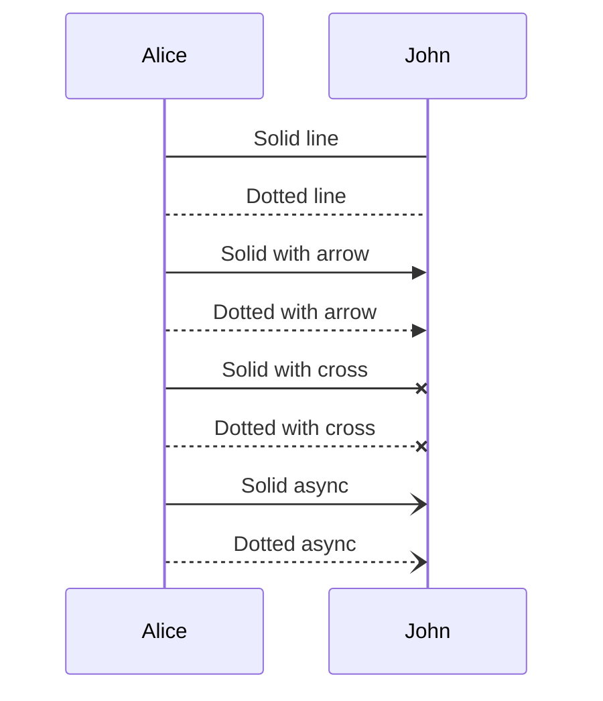
```mermaid
sequenceDiagram
    Alice->John: Solid line
    Alice-->John: Dotted line
    Alice->>John: Solid with arrow
    Alice-->>John: Dotted with arrow
    Alice-xJohn: Solid with cross
    Alice--xJohn: Dotted with cross
    Alice-)John: Solid async
    Alice--)John: Dotted async
```

@Image(source: "system-design-mermaid-sequence-diagrams-08-message-types.codex.svg", alt: "Message types diagram")


Bidirectional arrows (v11.0.0+):

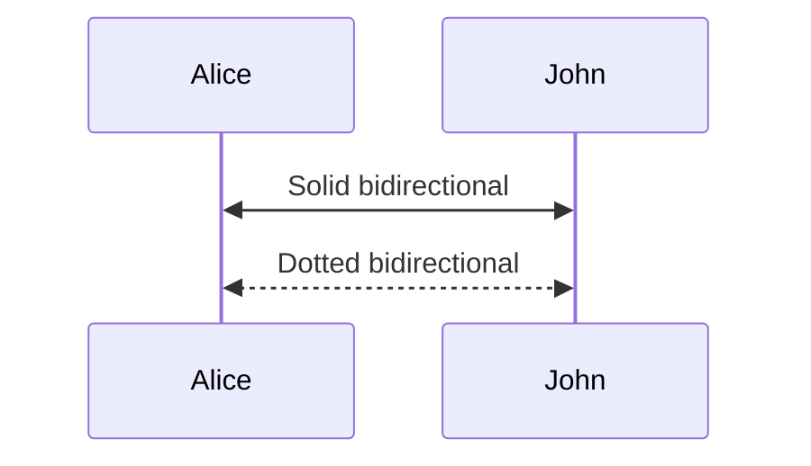
```mermaid
sequenceDiagram
    Alice<<->>John: Solid bidirectional
    Alice<<-->>John: Dotted bidirectional
```

@Image(source: "system-design-mermaid-sequence-diagrams-09-message-types.codex.svg", alt: "Message types diagram")


## Activations

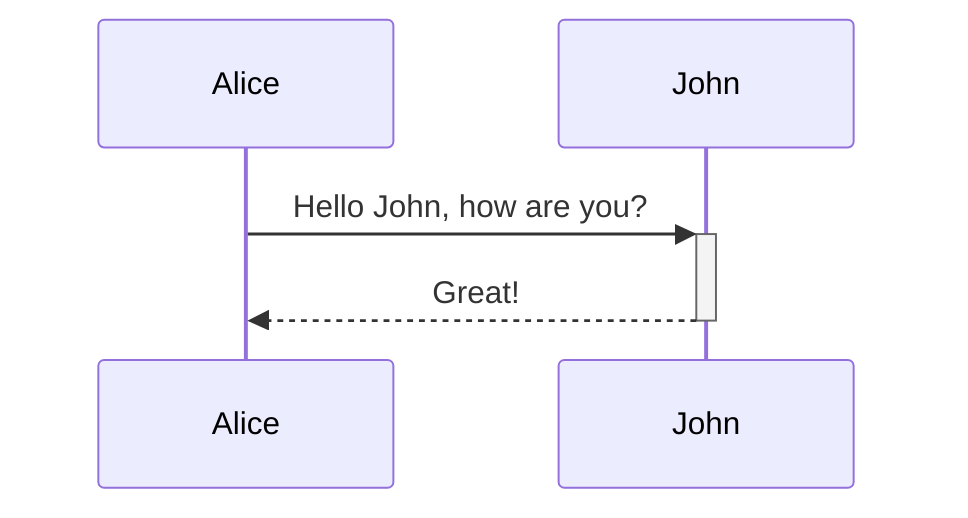
```mermaid
sequenceDiagram
    Alice->>+John: Hello John, how are you?
    John-->>-Alice: Great!
```

@Image(source: "system-design-mermaid-sequence-diagrams-10-activations.codex.svg", alt: "Activations diagram")


Stacked activations:

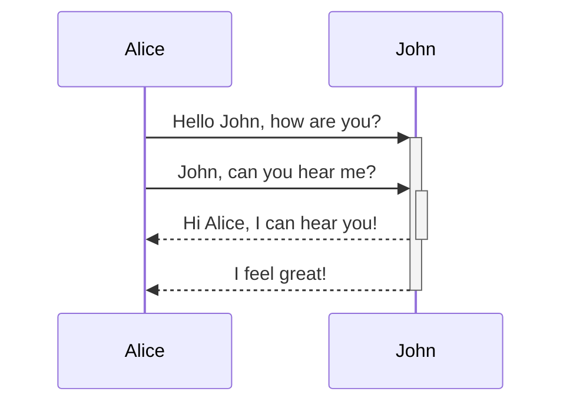
```mermaid
sequenceDiagram
    Alice->>+John: Hello John, how are you?
    Alice->>+John: John, can you hear me?
    John-->>-Alice: Hi Alice, I can hear you!
    John-->>-Alice: I feel great!
```

@Image(source: "system-design-mermaid-sequence-diagrams-11-activations.codex.svg", alt: "Activations diagram")


## Notes

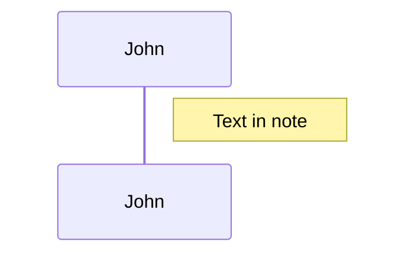
```mermaid
sequenceDiagram
    participant John
    Note right of John: Text in note
```

@Image(source: "system-design-mermaid-sequence-diagrams-12-notes.codex.svg", alt: "Notes diagram")


Notes across participants:

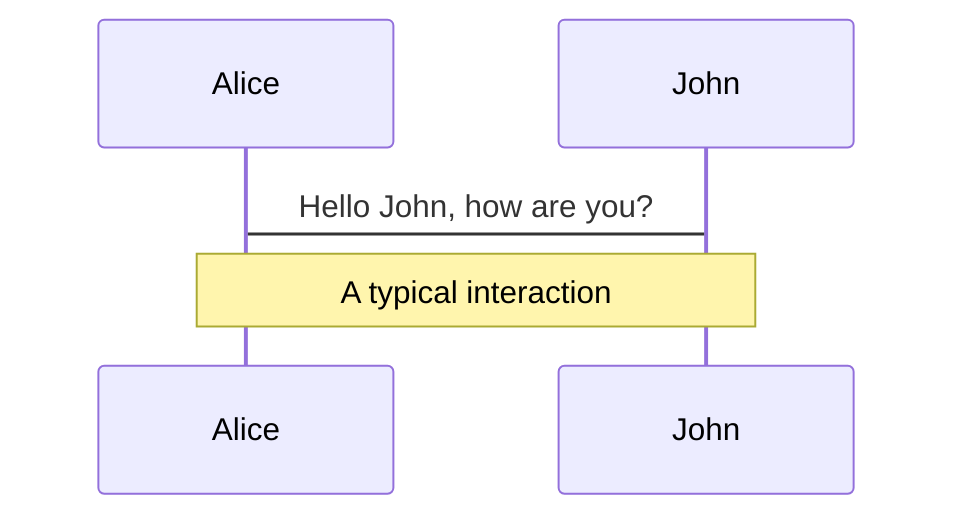
```mermaid
sequenceDiagram
    Alice->John: Hello John, how are you?
    Note over Alice,John: A typical interaction
```

@Image(source: "system-design-mermaid-sequence-diagrams-13-notes.codex.svg", alt: "Notes diagram")


## Line Breaks

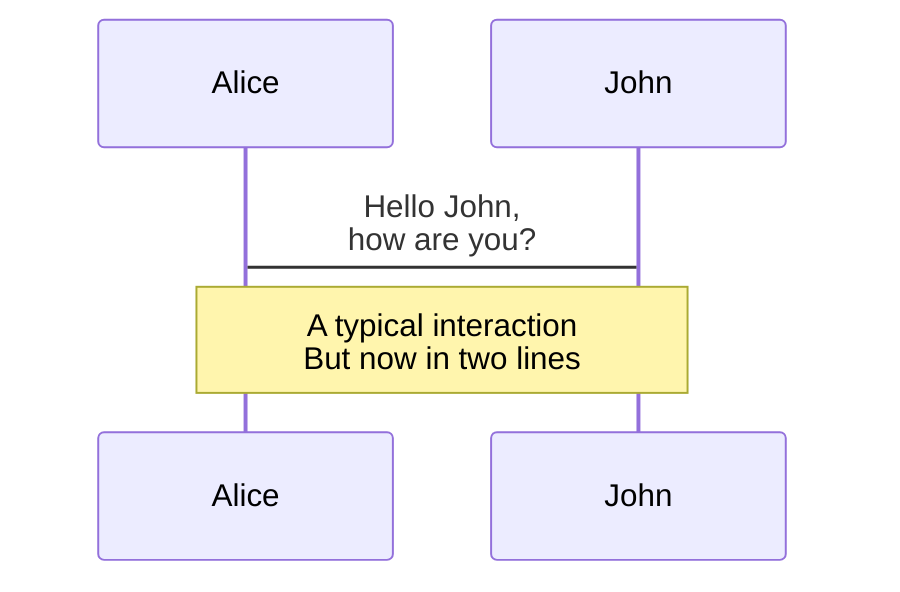
```mermaid
sequenceDiagram
    Alice->John: Hello John,<br/>how are you?
    Note over Alice,John: A typical interaction<br/>But now in two lines
```

@Image(source: "system-design-mermaid-sequence-diagrams-14-line-breaks.codex.svg", alt: "Line breaks diagram")


Line breaks in actor names require aliases:

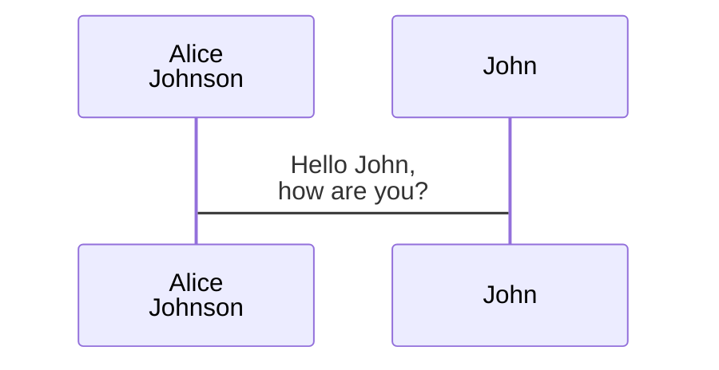
```mermaid
sequenceDiagram
    participant Alice as Alice<br/>Johnson
    Alice->John: Hello John,<br/>how are you?
```

@Image(source: "system-design-mermaid-sequence-diagrams-15-line-breaks.codex.svg", alt: "Line breaks diagram")


## Loops

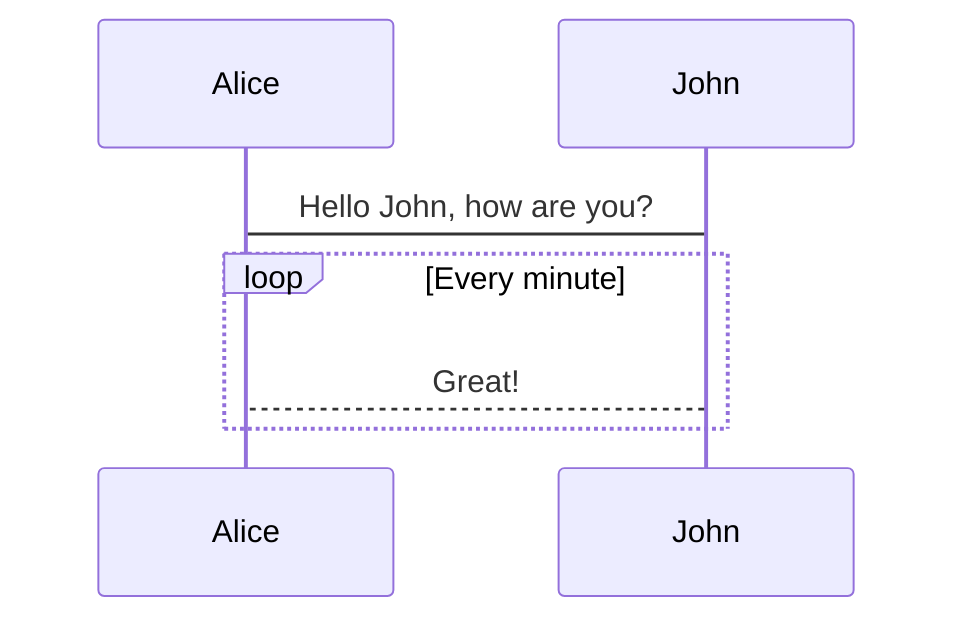
```mermaid
sequenceDiagram
    Alice->John: Hello John, how are you?
    loop Every minute
        John-->Alice: Great!
    end
```

@Image(source: "system-design-mermaid-sequence-diagrams-16-loops.codex.svg", alt: "Loops diagram")


## Alt Opt

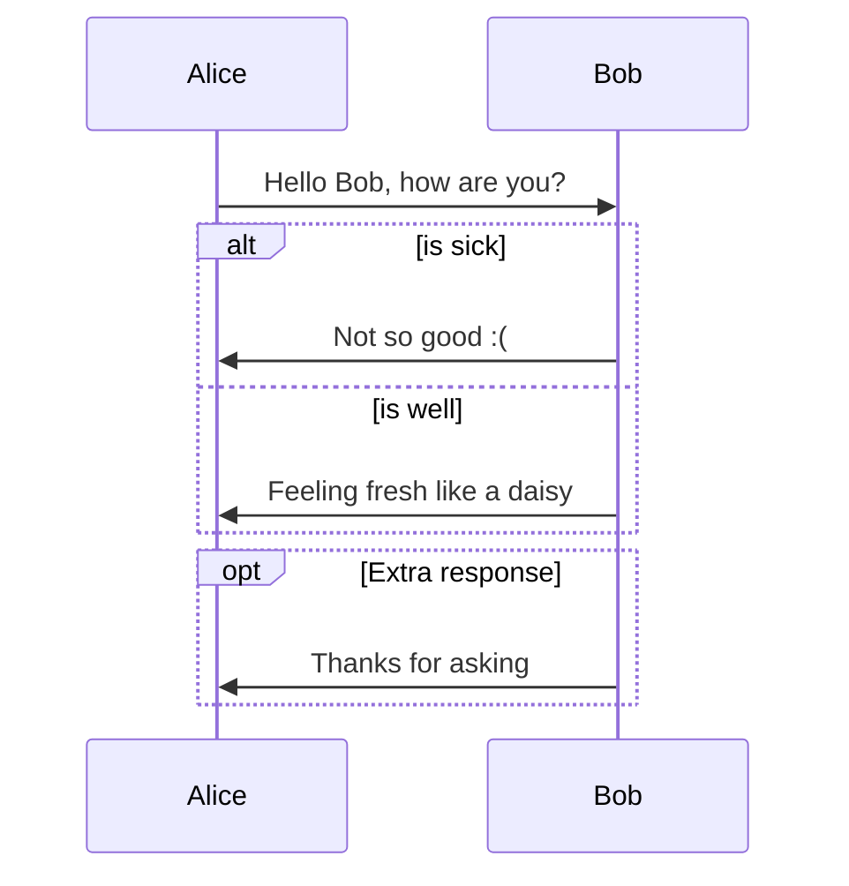
```mermaid
sequenceDiagram
    Alice->>Bob: Hello Bob, how are you?
    alt is sick
        Bob->>Alice: Not so good :(
    else is well
        Bob->>Alice: Feeling fresh like a daisy
    end
    opt Extra response
        Bob->>Alice: Thanks for asking
    end
```

@Image(source: "system-design-mermaid-sequence-diagrams-17-alt-opt.codex.svg", alt: "Alt / opt diagram")


## Parallel

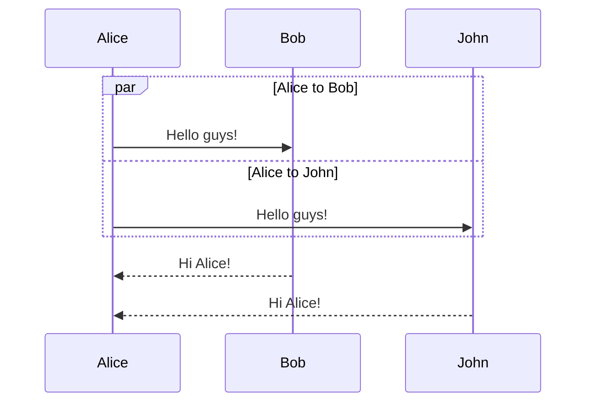
```mermaid
sequenceDiagram
    par Alice to Bob
        Alice->>Bob: Hello guys!
    and Alice to John
        Alice->>John: Hello guys!
    end
    Bob-->>Alice: Hi Alice!
    John-->>Alice: Hi Alice!
```

@Image(source: "system-design-mermaid-sequence-diagrams-18-parallel.codex.svg", alt: "Parallel diagram")


## Critical Region

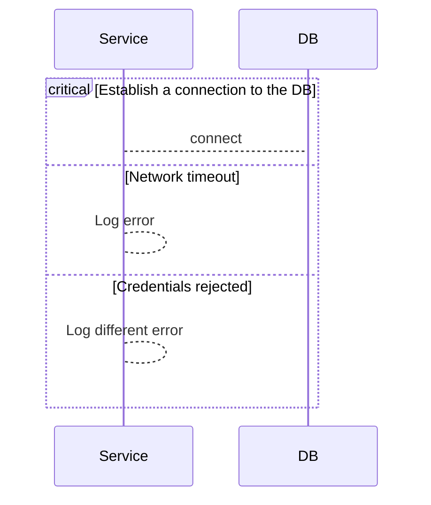
```mermaid
sequenceDiagram
    critical Establish a connection to the DB
        Service-->DB: connect
    option Network timeout
        Service-->Service: Log error
    option Credentials rejected
        Service-->Service: Log different error
    end
```

@Image(source: "system-design-mermaid-sequence-diagrams-19-critical-region.codex.svg", alt: "Critical region diagram")


## Break

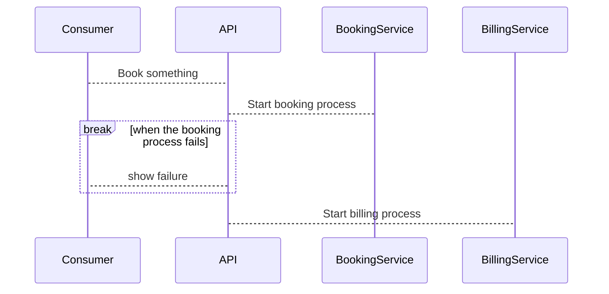
```mermaid
sequenceDiagram
    Consumer-->API: Book something
    API-->BookingService: Start booking process
    break when the booking process fails
        API-->Consumer: show failure
    end
    API-->BillingService: Start billing process
```

@Image(source: "system-design-mermaid-sequence-diagrams-20-break.codex.svg", alt: "Break diagram")


## Background Highlighting

```mermaid
sequenceDiagram
    participant Alice
    participant John

    rect rgb(191, 223, 255)
    note right of Alice: Alice calls John.
    Alice->>+John: Hello John, how are you?
    rect rgb(200, 150, 255)
    Alice->>+John: John, can you hear me?
    John-->>-Alice: Hi Alice, I can hear you!
    end
    John-->>-Alice: I feel great!
    end
```

@Image(source: "system-design-mermaid-sequence-diagrams-21-background-highlighting.codex.svg", alt: "Background highlighting diagram")


## Comments

```mermaid
sequenceDiagram
    Alice->>John: Hello John, how are you?
    %% this is a comment
    John-->>Alice: Great!
```

@Image(source: "system-design-mermaid-sequence-diagrams-22-comments.codex.svg", alt: "Comments diagram")


## Entity Codes

```mermaid
sequenceDiagram
    A->>B: I #9829; you!
    B->>A: I #9829; you #infin; times more!
```

@Image(source: "system-design-mermaid-sequence-diagrams-23-entity-codes.codex.svg", alt: "Entity codes diagram")


## Sequence Numbers

```mermaid
sequenceDiagram
    autonumber
    Alice->>John: Hello John, how are you?
    loop HealthCheck
        John->>John: Fight against hypochondria
    end
    Note right of John: Rational thoughts!
    John-->>Alice: Great!
```

@Image(source: "system-design-mermaid-sequence-diagrams-24-sequence-numbers.codex.svg", alt: "Sequence numbers diagram")


## Actor Menus

```mermaid
sequenceDiagram
    participant Alice
    participant John
    link Alice: Dashboard @ https://dashboard.contoso.com/alice
    link Alice: Wiki @ https://wiki.contoso.com/alice
    link John: Dashboard @ https://dashboard.contoso.com/john
    link John: Wiki @ https://wiki.contoso.com/john
    Alice->>John: Hello John, how are you?
    John-->>Alice: Great!
```

@Image(source: "system-design-mermaid-sequence-diagrams-25-actor-menus.codex.svg", alt: "Actor menus diagram")


## Configuration

You can configure margins and typography in Mermaid config:

```javascript
mermaid.sequenceConfig = {
  diagramMarginX: 50,
  diagramMarginY: 10,
  boxTextMargin: 5,
  noteMargin: 10,
  messageMargin: 35,
  mirrorActors: true,
};
```
