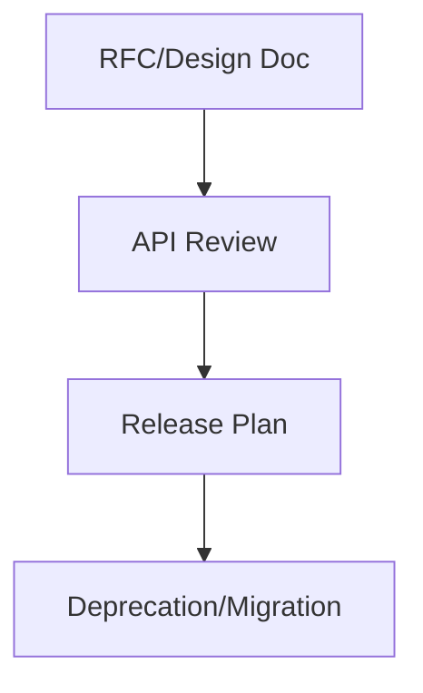
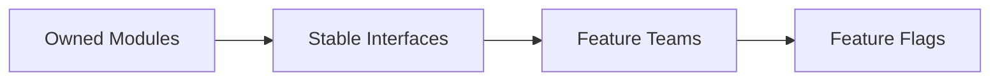
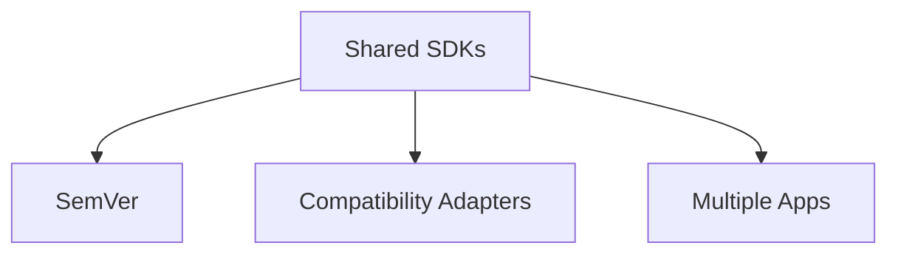
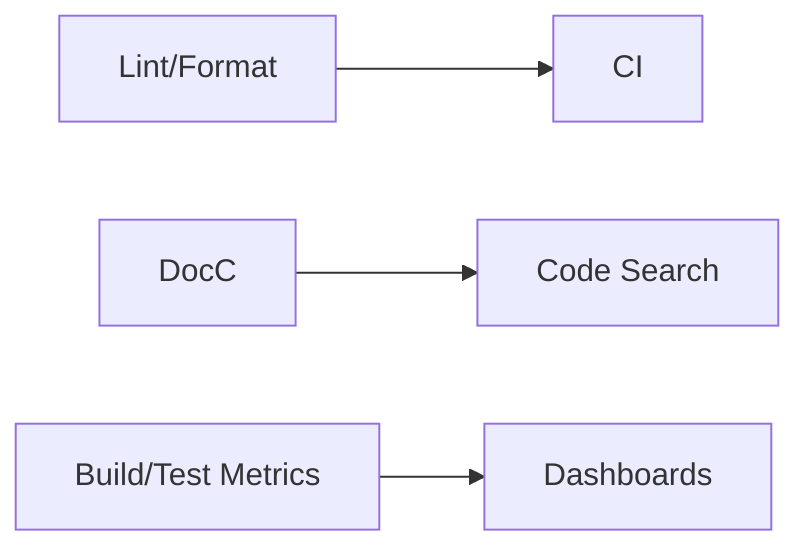
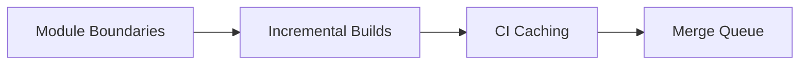
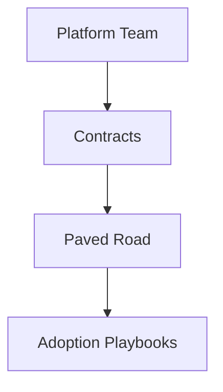

@PageImage(purpose: card, source: "system-design-mermaid-challenges-part-3-ios-teams-card.codex", alt: "Placeholder card")
@Image(source: "system-design-mermaid-challenges-part-3-ios-teams-hero.codex", alt: "Placeholder hero")
@PageImage(purpose: icon, source: "system-design-mermaid-challenges-part-3-ios-teams-icon.codex", alt: "Placeholder icon")
# System Design Challenges (Large iOS Teams)

@Metadata {
  @TitleHeading("Large iOS teams: 7 challenge diagrams")
  @PageColor(orange)
  @PageImage(purpose: icon, source: "system-design-icon.codex", alt: "System Design icon")
  @PageImage(purpose: card, source: "system-design-card.codex", alt: "System Design card")
}

Use these diagrams to rehearse large-team challenges in Part III.

## 18) Planning and Decision Making

@Image(source: "system-design-mermaid-challenges-part-3-ios-teams-01-18-planning-and-decision-making.codex.svg", alt: "18) Planning and decision making diagram")

## 19) Avoid Stepping on Each Other’s Toes

@Image(source: "system-design-mermaid-challenges-part-3-ios-teams-02-19-avoid-stepping-on-each-other-s-toes.codex.svg", alt: "19) Avoid stepping on each other’s toes diagram")

## 20) Shared Architecture Across Apps

@Image(source: "system-design-mermaid-challenges-part-3-ios-teams-03-20-shared-architecture-across-apps.codex.svg", alt: "20) Shared architecture across apps diagram")

## 21) Tooling Maturity

@Image(source: "system-design-mermaid-challenges-part-3-ios-teams-04-21-tooling-maturity.codex.svg", alt: "21) Tooling maturity diagram")

## 22) Scaling Build & Merge Times

@Image(source: "system-design-mermaid-challenges-part-3-ios-teams-05-22-scaling-build-merge-times.codex.svg", alt: "22) Scaling build & merge times diagram")

## 23) Mobile Platform Libraries and Teams

@Image(source: "system-design-mermaid-challenges-part-3-ios-teams-06-23-mobile-platform-libraries-and-teams.codex.svg", alt: "23) Mobile platform libraries and teams diagram")

## 24) In-app Purchases (iOS)

@Image(source: "system-design-mermaid-challenges-part-3-ios-teams-07-24-in-app-purchases-ios.codex.svg", alt: "24) In-app purchases (iOS) diagram")

