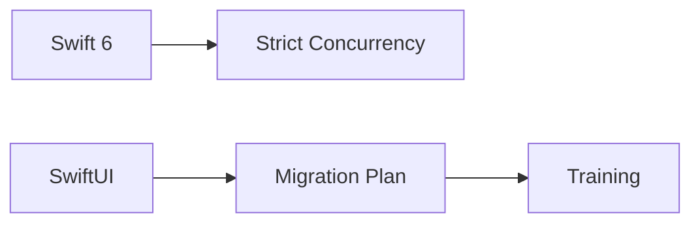
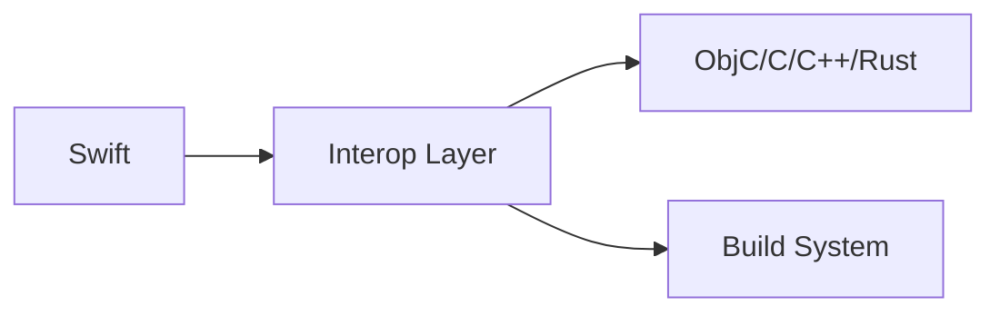
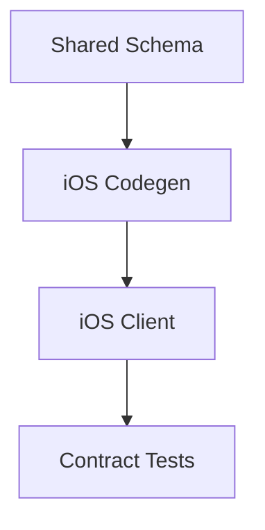
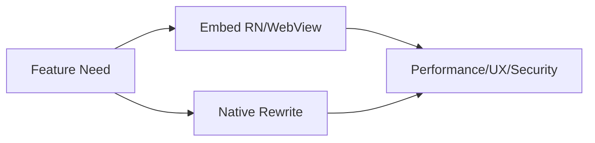
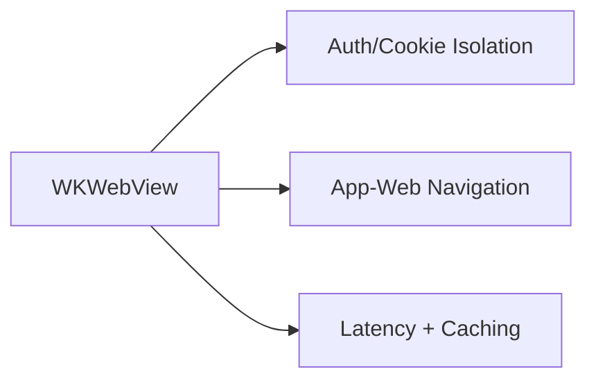

@PageImage(purpose: card, source: "system-design-mermaid-challenges-part-4-ios-language-xplat-card.codex", alt: "Placeholder card")
@Image(source: "system-design-mermaid-challenges-part-4-ios-language-xplat-hero.codex", alt: "Placeholder hero")
@PageImage(purpose: icon, source: "system-design-mermaid-challenges-part-4-ios-language-xplat-icon.codex", alt: "Placeholder icon")
# System Design Challenges (Languages + Cross-platform)

@Metadata {
  @TitleHeading("Languages + cross-platform: 5 challenge diagrams")
  @PageColor(orange)
  @PageImage(purpose: icon, source: "system-design-icon.codex", alt: "System Design icon")
  @PageImage(purpose: card, source: "system-design-card.codex", alt: "System Design card")
}

Use these diagrams to rehearse Part IV challenges.

## 25) Adopting New Languages and Frameworks

@Image(source: "system-design-mermaid-challenges-part-4-ios-language-xplat-01-25-adopting-new-languages-and-frameworks.codex.svg", alt: "25) Adopting new languages and frameworks diagram")

## 26) Interop Reality (Objective-C/C/C++/Rust)

@Image(source: "system-design-mermaid-challenges-part-4-ios-language-xplat-02-26-interop-reality-objective-c-c-c-rust.codex.svg", alt: "26) Interop reality (Objective-C/C/C++/Rust) diagram")

## 27) Cross-platform Feature Development (iOS-native)

@Image(source: "system-design-mermaid-challenges-part-4-ios-language-xplat-03-27-cross-platform-feature-development-ios-native.codex.svg", alt: "27) Cross-platform feature development (iOS-native) diagram")

## 28) Cross-platform vs Native Decision

@Image(source: "system-design-mermaid-challenges-part-4-ios-language-xplat-04-28-cross-platform-vs-native-decision.codex.svg", alt: "28) Cross-platform vs native decision diagram")

## 29) Web/PWA & Backend-driven Apps

@Image(source: "system-design-mermaid-challenges-part-4-ios-language-xplat-05-29-web-pwa-backend-driven-apps.codex.svg", alt: "29) Web/PWA & backend-driven apps diagram")

