@PageImage(purpose: card, source: "system-design-mermaid-class-diagrams-card.codex", alt: "Placeholder card")
@Image(source: "system-design-mermaid-class-diagrams-hero.codex", alt: "Placeholder hero")
@PageImage(purpose: icon, source: "system-design-mermaid-class-diagrams-icon.codex", alt: "Placeholder icon")
# Mermaid Class Diagrams (System Design)

@Metadata {
  @TitleHeading("Mermaid class diagrams reference")
  @PageColor(blue)
  @PageImage(purpose: icon, source: "system-design-icon.codex", alt: "System Design icon")
  @PageImage(purpose: card, source: "system-design-card.codex", alt: "System Design card")
}

Use this reference for Mermaid class diagrams when modeling object-oriented system design.

## Overview

Class diagrams show classes, attributes, methods, and relationships. Mermaid renders UML-style
class diagrams with a concise syntax.

## Basic Example

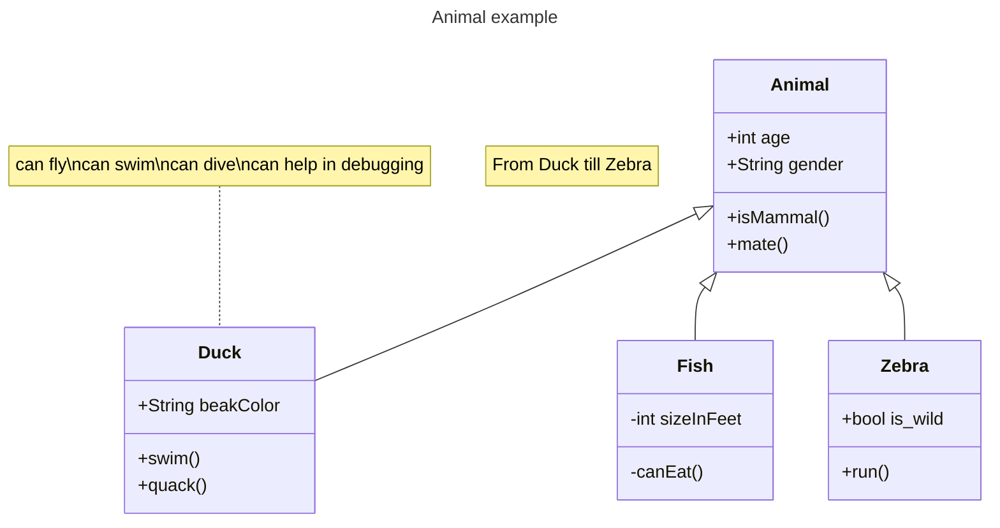

@Image(source: "system-design-mermaid-class-diagrams-01-basic-example.codex.svg", alt: "Basic example diagram")


## Class Definition

Define classes either explicitly or via relationships.

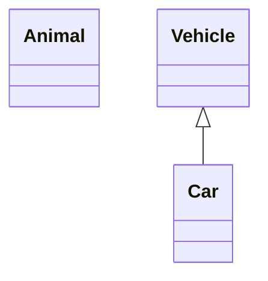

@Image(source: "system-design-mermaid-class-diagrams-02-class-definition.codex.svg", alt: "Class definition diagram")


Naming convention: use alphanumeric characters, underscores, and dashes.

## Class Labels

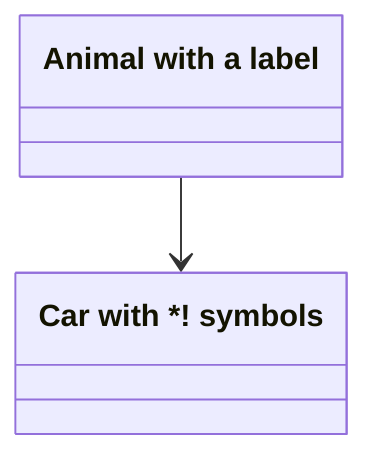

@Image(source: "system-design-mermaid-class-diagrams-03-class-labels.codex.svg", alt: "Class labels diagram")


Escape special characters with backticks:

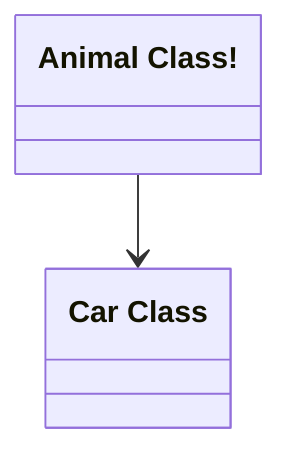

@Image(source: "system-design-mermaid-class-diagrams-04-class-labels.codex.svg", alt: "Class labels diagram")


## Members

Use `:` for one member at a time:

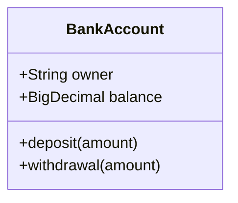

@Image(source: "system-design-mermaid-class-diagrams-05-members.codex.svg", alt: "Members diagram")


Use `{}` to group members:


@Image(source: "system-design-mermaid-class-diagrams-06-members.codex.svg", alt: "Members diagram")


### Return Types

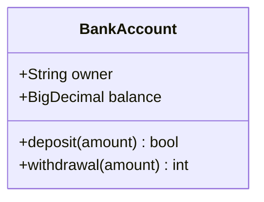

@Image(source: "system-design-mermaid-class-diagrams-07-members.codex.svg", alt: "Members diagram")


### Generic Types

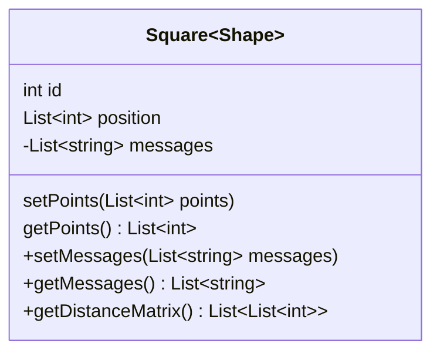

@Image(source: "system-design-mermaid-class-diagrams-08-members.codex.svg", alt: "Members diagram")


## Visibility and Classifiers

Visibility:

- `+` Public
- `-` Private
- `#` Protected
- `~` Package/Internal

Classifiers:

- `*` Abstract
- `$` Static

## Relationships

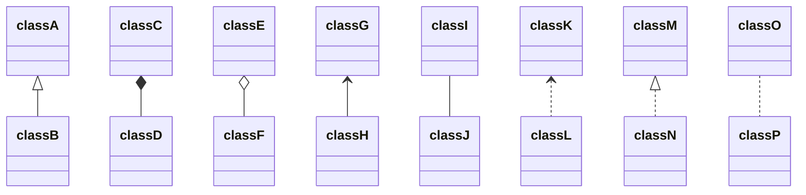

@Image(source: "system-design-mermaid-class-diagrams-09-relationships.codex.svg", alt: "Relationships diagram")


With labels:

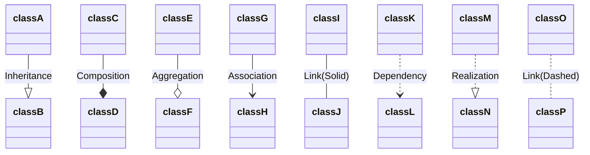

@Image(source: "system-design-mermaid-class-diagrams-10-relationships.codex.svg", alt: "Relationships diagram")


### Lollipop Interfaces

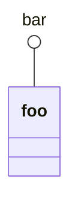

@Image(source: "system-design-mermaid-class-diagrams-11-relationships.codex.svg", alt: "Relationships diagram")


## Namespaces

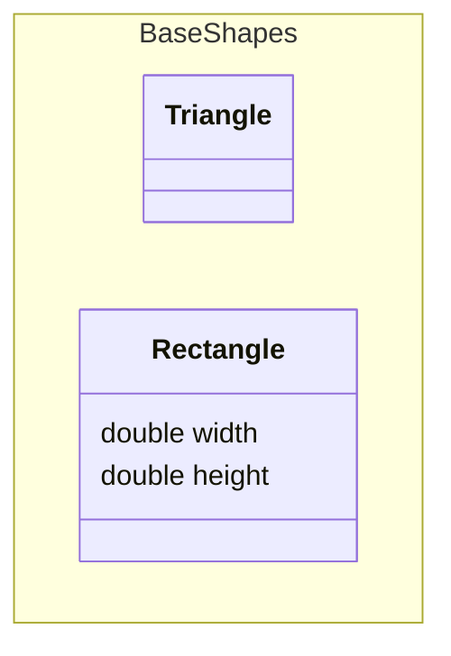

@Image(source: "system-design-mermaid-class-diagrams-12-namespaces.codex.svg", alt: "Namespaces diagram")


## Cardinality Multiplicity

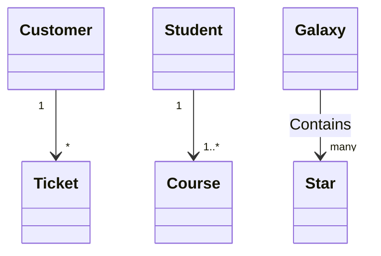

@Image(source: "system-design-mermaid-class-diagrams-13-cardinality-multiplicity.codex.svg", alt: "Cardinality / multiplicity diagram")


## Annotations

Inline annotations are not supported by every Mermaid renderer. Use the separate line form for
maximum compatibility:

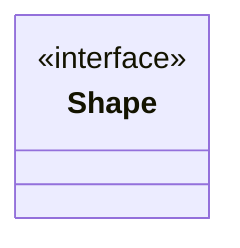

@Image(source: "system-design-mermaid-class-diagrams-14-annotations.codex.svg", alt: "Annotations diagram")


Nested:

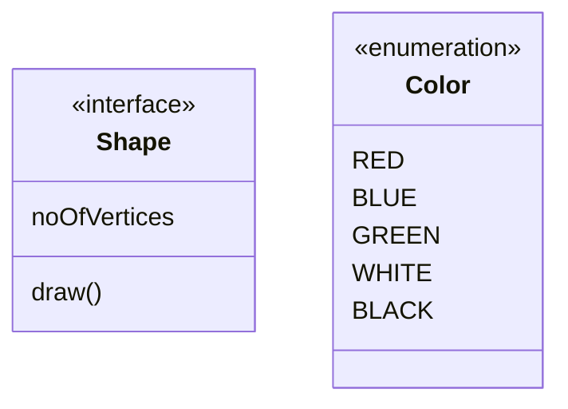

@Image(source: "system-design-mermaid-class-diagrams-15-annotations.codex.svg", alt: "Annotations diagram")


## Notes

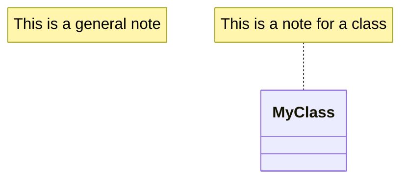

@Image(source: "system-design-mermaid-class-diagrams-16-notes.codex.svg", alt: "Notes diagram")


## Direction

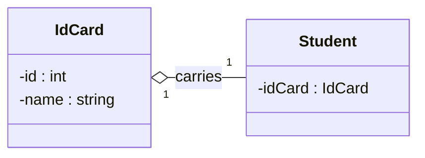

@Image(source: "system-design-mermaid-class-diagrams-17-direction.codex.svg", alt: "Direction diagram")


## Interaction

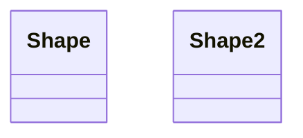

@Image(source: "system-design-mermaid-class-diagrams-18-interaction.codex.svg", alt: "Interaction diagram")


## Styling

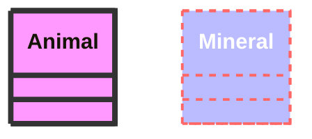

@Image(source: "system-design-mermaid-class-diagrams-19-styling.codex.svg", alt: "Styling diagram")


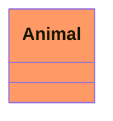

@Image(source: "system-design-mermaid-class-diagrams-20-styling.codex.svg", alt: "Styling diagram")


Default class:

```mermaid
classDiagram
  class Animal:::pink
  class Mineral

  classDef default fill:#f96,color:red
  classDef pink color:#f9f
```

@Image(source: "system-design-mermaid-class-diagrams-21-styling.codex.svg", alt: "Styling diagram")


## Configuration

Hide empty members box:

```mermaid
---
config:
  class:
    hideEmptyMembersBox: true
---
classDiagram
  class Duck
```

@Image(source: "system-design-mermaid-class-diagrams-22-configuration.codex.svg", alt: "Configuration diagram")

