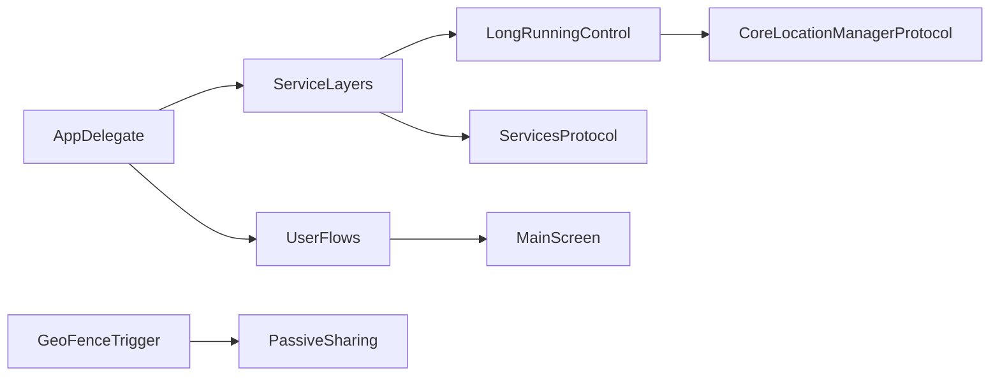
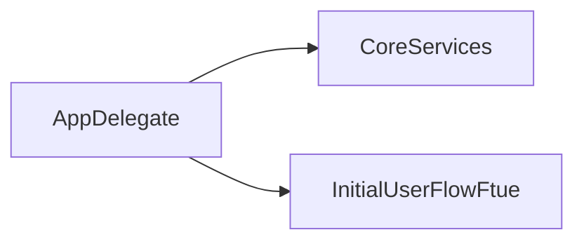
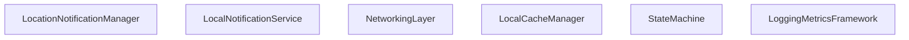
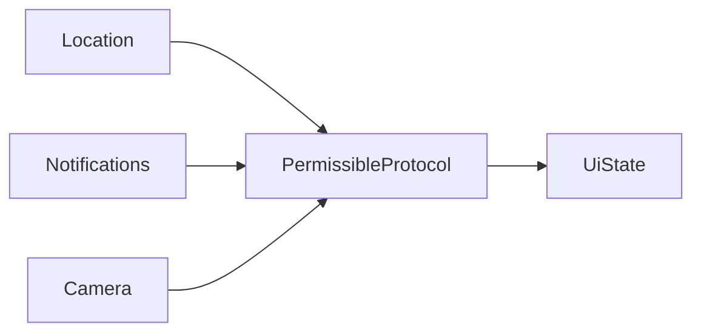
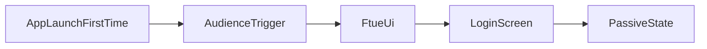
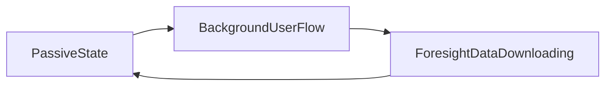
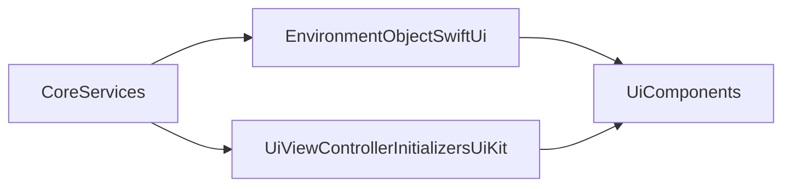
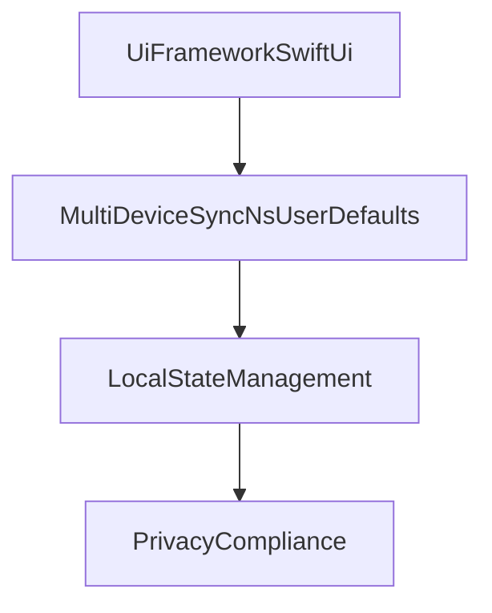

@PageImage(purpose: card, source: "snap-snap-excalidraw-templates-card.codex", alt: "Placeholder card")
@PageImage(purpose: icon, source: "snap-snap-excalidraw-templates-icon.codex", alt: "Placeholder icon")
# Snapsnap Excalidraw Templates

@Metadata {
  @TitleHeading("Mermaid templates for Excalidraw")
  @PageColor(red)
  @PageImage(purpose: icon, source: "system-design-icon.codex", alt: "System design icon")
  @PageImage(purpose: card, source: "system-design-card.codex", alt: "System design card")
}

@Image(source: "snap-snap-excalidraw-templates-hero.codex", alt: "Snapsnap excalidraw templates hero")

Use these Mermaid blocks as Excalidraw-ready templates. Keep labels CamelCase with no spaces.
Source files live in `Resources/mermaid/snapsnap-excalidraw-templates/` and rendered SVGs live in
`Resources/`.

## System at a Glance

@Image(source: "system-at-a-glance.codex", alt: "System at a glance diagram")

## App Delegate Orchestration

@Image(source: "app-delegate-orchestration.codex", alt: "App delegate orchestration diagram")

## Core Service Layers

@Image(source: "core-service-layers.codex", alt: "Core service layers diagram")

## Permissions Services Protocol

@Image(source: "permissions-services-protocol.codex", alt: "Permissions services protocol diagram")

## One-shot Onboarding Flow

@Image(source: "one-shot-onboarding-flow.codex", alt: "One-shot onboarding flow diagram")

## Core Loop: Foresight

@Image(source: "core-loop-foresight.codex", alt: "Core loop foresight diagram")

## Main Screen State-driven UI

@Image(source: "main-screen-state-driven-ui.codex", alt: "Main screen state-driven UI diagram")

## Dependency Injection Weave

@Image(source: "dependency-injection-weave.codex", alt: "Dependency injection weave diagram")

## Platform and Technology Stack

@Image(source: "platform-technology-stack.codex", alt: "Platform and technology stack diagram")

## 45-Minute Tour Script

0:00 - 4:00: Frame the problem and constraints (passive experience, battery, privacy).

4:00 - 9:00: System overview.

- Diagram: <doc:snap-snap-excalidraw-templates#System-at-a-glance>
- Walk the entry points, service layers, user flows, and main screen.

9:00 - 13:00: Startup orchestration.

- Diagram: <doc:snap-snap-excalidraw-templates#App-delegate-orchestration>
- Explain how AppDelegate initializes core services and routes FTUE.

13:00 - 18:00: Core service layers.

- Diagram: <doc:snap-snap-excalidraw-templates#Core-service-layers>
- Name each service and why it is single-responsibility.

18:00 - 22:00: Permissions protocol.

- Diagram: <doc:snap-snap-excalidraw-templates#Permissions-services-protocol>
- Problem and solution: unify permission state for UI clarity.

22:00 - 26:00: One-shot onboarding.

- Diagram: <doc:snap-snap-excalidraw-templates#One-shot-onboarding-flow>
- Explain the single flow and why it reduces friction.

26:00 - 30:00: Passive loop and foresight.

- Diagram: <doc:snap-snap-excalidraw-templates#Core-loop-foresight>
- Show proactive downloads and why they unlock relevance.

30:00 - 34:00: Main screen UI states.

- Diagram: <doc:snap-snap-excalidraw-templates#Main-screen-state-driven-UI>
- Map states to content density and explain UI determinism.

34:00 - 38:00: Dependency injection.

- Diagram: <doc:snap-snap-excalidraw-templates#Dependency-injection-weave>
- Show service injection into SwiftUI/UIKit for testability.

38:00 - 42:00: Platform choices.

- Diagram: <doc:snap-snap-excalidraw-templates#Platform-and-technology-stack>
- Call out SwiftUI, sync, local state, and privacy compliance.

42:00 - 45:00: Questions and tradeoffs.

- Preempt battery vs freshness, permission UX risk, offline gaps, abuse cases.
- End with next-iteration deltas and open risks.
